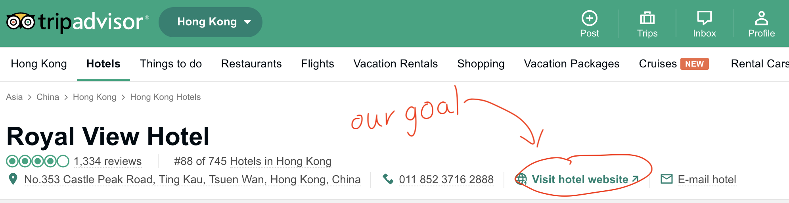
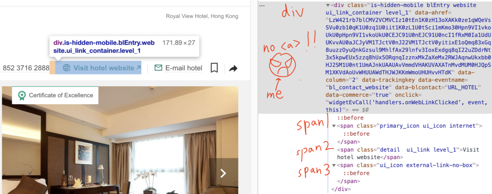
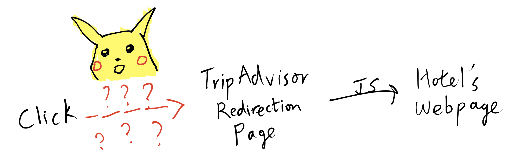
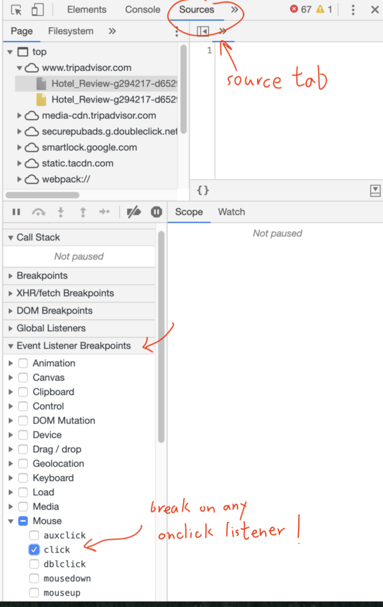
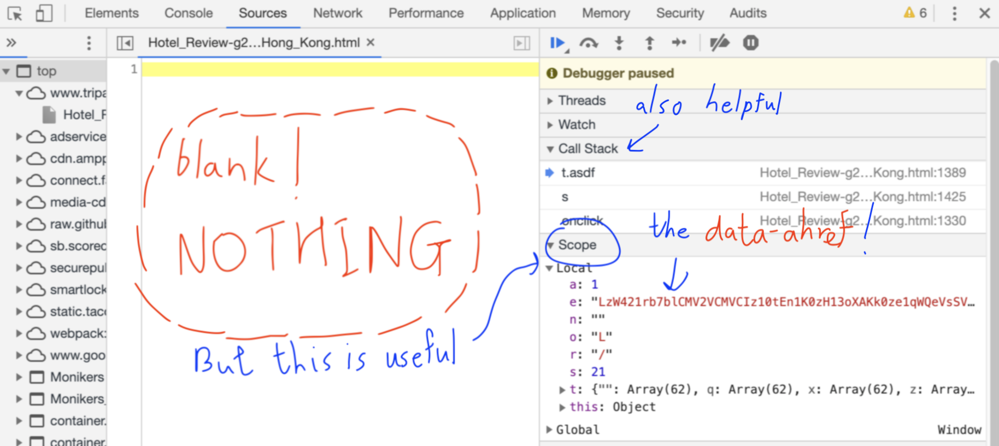
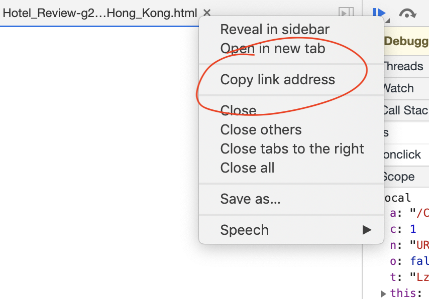

### `blogs[0] = new Blog();`
This is my first technical blog 
(indexed as the "zeroth" to fit into the CS persona).
I feel like I am finally technical enough with ample 
amount of CS theories (thanks UCLA for that) to write 
something up that makes more sense 
(and potentially interesting).

I sprinkle links on some technical terms in case 
you want to understand what they mean.

### The Trippy TripAdvisor 
Anyway, back to the main topic.
On the first day of internship, the company wants to run some tests
on some hotel websites for collecting some data. The first step is 
to get as many URLs of hotel websites as possible. 
An approach is to write a webparser for TripAdvisor.

#### <Insert Inspirational "Anchor" Quote\>
There is a link to the hotel's webpage right on the 
TripAdvisor page for each hotel.



Cool, our job is done. Just search for that 
[anchor tag](https://www.w3schools.com/tags/tag_a.asp) 
(`<a href="xxx">`) and we are good to go. 
Easy. At this point, I was thinking about what to eat 
for dinner already.

$$
\mathcal {When\;you\;think\;it's\;easy,}\\
\mathcal {it\;is\;really\;not.}
- \text{Me, Right now}
$$

Let's check the anchor tag out, with everybody's favorite
[$\mathcal Chrome\;Dev\;Tools$](https://developers.google.com/web/tools/chrome-devtools/). 
Then, we can use the same 
[XPath](https://www.w3schools.com/xml/xml_xpath.asp) 
to get the data and just extract `a.href` property.



$\mathcal{NANI?!}$ There is no anchor tag. 
How does that work? When you click on the element,
it opens a new tab. Then, it takes you to a URL that 
belongs to TripAdvisor. For instance,
 
`https://www.tripadvisor.com/Commerce?p=TABAIndependentHotels&src=0&from=Hotel_Review&...` (omitted for readability)

After that, you get redirected to the actual website. 
Curiously, the way that the redirection is done is 
__not__ through the 
[HTTP 300 status codes](https://developer.mozilla.org/en-US/docs/Web/HTTP/Status#Redirection_messages). 
They did it through JavaScript! The above URL 
returns the following html page 
(information are hidden for readability). 

```html
<!DOCTYPE html>
<html>
  <script type="text/javascript">
    window.onload = function() {
      try {
        if ("") {
          if (true) {
            window.history.replaceState({fromBABackClick: true}, null, "");
          }
          else {
            window.history.replaceState({fromBackClick: true}, null, "");
          }
        }
        setTimeout(function() { window.location.href = "http://www.royalview.com.hk/eng/index.html?utm_source=TripAdvisor&utm_medium=BusinessListing&utm_campaign=TripAdvisor&utm_term=Website&utm_content=Website"; });
      } catch (e) {
        window.location.replace("http://www.royalview.com.hk/eng/index.html?utm_source=TripAdvisor&utm_medium=BusinessListing&utm_campaign=TripAdvisor&utm_term=Website&utm_content=Website");
      }
    };
  </script>
</html>
```

Then, the redirection is done through changing
`window.location.href`. 
A thing that confuses me is the condition of the 
if statements. What is up with `if ("")` and `if (true)`?
~~Did TripAdvisor engineer not take intro CS course?~~
I feel like this html page is probably generated from a 
template. If certain conditions are true, for instance,
the `User-Agent` in the HTTP request header is not 
(too obvisouly) a bot, they fill in the condition as 
`true` or `""` or some other literals. But this is just 
my guess.

Now, I understand how the redirection works.
The link is clicked, a new tab opens that points to 
a TripAdvisor endpoint, which returns a script that 
redirect you to the actual site.

Then, the parser will just need to get the script and 
extract the URL. A simple regular expression will work
here. To get a clean URL without the utm
parameters, which are used by Google Analytics, we 
can use the `URL` object in JavaScript (or the equivalent
URL parsing utils in other languages) to decode it 
and remove the query parameters. 

#### How to Get Redirected?

The problem is still not fully solved yet! 
How did we get the TripAdvisor link to get redirected 
anyway? Aka…

`https://www.tripadvisor.com/Commerce?p=TABAIndependentHotels&src=0&geo=652907&from=Hotel_Review&...` (How do we get this?)



Again, there is no anchor tag. The only possibility
is that some JavaScript code opens the new tab.
The closest thing that I can find is a suspicious
`data-ahref` attribute within the `div` tag,
and the `onclick` event of the tag.

```html
<div 
class="is-hidden-mobile blEntry website  ui_link_container level_1" 
data-ahref="LzW421rb7blCMV2VCMVCIz10...(omitted)" 
data-column="2" 
data-trackingkey="" 
data-eventname="bl_contact_website" 
data-blcontact="URL_HOTEL" 
data-commerce="true" 
onclick="widgetEvCall('handlers.onWebLinkClicked', event, this)">
```

If it is JavaScript, then it will be "easy" to find 
how it works. 
Again using the debugger in our fav 
$\mathcal Chrome\;Dev\;Tool$, we set a breakpoint on the `onclick` 
event.



#### Stepping through the code
Turns out it was not as easy as I think it would be.
The JavaScript are being embedded into a html file.
For some reason, the Chrome debugger is not 
showing the file 😞. Maybe it is beacause it is 
[minified](https://developers.google.com/speed/docs/insights/MinifyResources).



However, the `Scope` tab is quite useful. 
The `Scope` tab displays the names and the values
of the variables or constants that can be accessed
within the current execution frame 
(the current function stack, if we think about it
in the C/C++ way). These variables and constants
are inside to be __in scope__ of the current 
function.
Looking at the change of the local variables, we 
found that the variable `e` was assigned the 
mysterisous `data-ahref` attribute inside the `div` 
that brings us to the hotel webpage. 

Now, to really understands what happens, we also want
to look at the `Call Stack` tab. The name is quite
self-explanatory. When the variable `e` holds the 
value of the `data-ahref` attribute, we are in a
function called `t.asdf`.
We step out of the `t.asdf` function and found that 
there is a return value of 

`/Commerce?p=TABAIndependentHotels&src=0&geo=652907&from=Hotel_Review&area=&slot=1&`
(omitted for readability).

If you prepend `www.tripadvisor.com`, that is exactly
the webpage that returns the redirection script!

$\LARGE{\mathcal BINGO!}$

This means that some function `t.asdf` takes in
the `data-ahref` value, decodes it and returns us the 
correct URL!

Now, we read the source code. 
Chrome Debugger is not showing me the code, 
but we know which file it is in.
Chrome Debugger opens a window that "shows" the file
that the script being executed is in.
It is some file called `Hotel_Review....Hong_Kong.html`.

We right click on the tab, get the link to this file.



We download it with `curl`
([read about curl](https://linux.die.net/man/1/curl)). 

<h2> <kbd>Ctrl</kbd>+<kbd>F</kbd> </h2>


Finally, we find the `t.asdf` function 
and study its definition. 
The code is not readable since the HTML file
is minified. I used VSCode Beautify extension
to pretty print the code.

```js
define("utils/asdf-encoder", ["ns-exporter", "vanillajs"], function (e) {
    "use strict";
    var t = {};
    return t.getOffset = function (e) {
        return e >= 97 && e <= 122 ? e - 61 : e >= 65 && e <= 90 ? e - 55 : e >= 48 && e <= 71 ? e - 48 : -1
    }, t.asdf = function (e) {
        for (var t = {
                "": ["&", "=", "p", "6", "?", "H", "%", "B", ".com", "k", "9", ".html", "n", "M", "r", "www.", "h", "b", "t", "a", "0", "/", "d", "O", "j", "http://", "_", "L", "i", "f", "1", "e", "-", "2", ".", "N", "m", "A", "l", "4", "R", "C", "y", "S", "o", "+", "7", "I", "3", "c", "5", "u", 0, "T", "v", "s", "w", "8", "P", 0, "g", 0],
                "q": [0, "__3F__", 0, "Photos", 0, "https://", ".edu", "*", "Y", ">", 0, 0, 0, 0, 0, 0, "`", "__2D__", "X", "<", "slot", 0, "ShowUrl", "Owners", 0, "[", "q", 0, "MemberProfile", 0, "ShowUserReviews", '"', "Hotel", 0, 0, "Expedia", "Vacation", "Discount", 0, "UserReview", "Thumbnail", 0, "__2F__", "Inspiration", "V", "Map", ":", "@", 0, "F", "help", 0, 0, "Rental", 0, "Picture", 0, 0, 0, "hotels", 0, "ftp://"],
                "x": [0, 0, "J", 0, 0, "Z", 0, 0, 0, ";", 0, "Text", 0, "(", "x", "GenericAds", "U", 0, "careers", 0, 0, 0, "D", 0, "members", "Search", 0, 0, 0, "Post", 0, 0, 0, "Q", 0, "$", 0, "K", 0, "W", 0, "Reviews", 0, ",", "__2E__", 0, 0, 0, 0, 0, 0, 0, "{", "}", 0, "Cheap", ")", 0, 0, 0, "#", ".org"],
                "z": [0, "Hotels", 0, 0, "Icon", 0, 0, 0, 0, ".net", 0, 0, "z", 0, 0, "pages", 0, "geo", 0, 0, 0, "cnt", "~", 0, 0, "]", "|", 0, "tripadvisor", "Images", "BookingBuddy", 0, "Commerce", 0, 0, "partnerKey", 0, "area", 0, "Deals", "from", "\\", 0, "urlKey", 0, "'", 0, "WeatherUnderground", 0, "MemberSign", "Maps", 0, "matchID", "Packages", "E", "Amenities", "Travel", ".htm", 0, "!", "^", "G"]
            }, r = "", a = 0; a < e.length; a++) {
            var n = e.charAt(a),
                o = n;
            t[n] && a + 1 < e.length ? (a++, o += e.charAt(a)) : n = "";
            var s = getOffset(e.charCodeAt(a));
            r += s < 0 || "String" == typeof t[n][s] ? o : t[n][s]
        }
        return r
    }, e.exportTo(t), t
});
```

So they uses some encoding and decoding scheme, 
and this `asdf` function is to decode the string.
__There is absolutely no need to understand how the 
decoding and encoding works.__
Our goal is to get the URL. 
We can find the encoded version very easily via XPath.
We also have the decoder function. 

There is really no difficulty left to parsing 
the URL.

To be very honest, after so much complexity, 
I was expecting that may be they encode each 
URL differently. May be there is a custom decoding
function for each different hotel. I might have to
extract the decoder function from the html page!
What a nightmare. But gladly it is only a dream, 
since this decoder works on all of the links!


### Afterthoughts

I have heard there are different approaches to this
task. Some parses the name of the hotel instead,
followed by a Google search on the name and attempt
to filter out the result from TripAdvisor or 
Booking.com. IMO it is quite unreliable since 
it is hard to make sure that it is correct.
I do not know if the person had looked into getting
the link from the website. I would have given up
if I do not have that much free time to mess with it.
Got better things in life to do amirite...

I also found other articles about parsing TripAdvisor
links. It turns out people had already done similar
things before. For instance, this one:
https://kaijento.github.io/2017/03/17/web-scraping-tripadvisor.com/. 
But you have to trust me. 
I really did everything on my own `:|`. 
The main point of the post is not to show how 
you can crawl TripAdvisor URL. But rather how I 
approached the problem and solve it with the available
tooling. If you want the code to do the parsing, 
check the other block post I linked above.

But looking at the code above, 
I have some more questions to think about now. 
For instance, in the `t.getOffset` helper function, 
which is used by `t.asdf` decoder, the logic is written
in the ternary operator `<cond>?<then>:<else>`.
It is not only one condition, it is multiple ternary
condition aggregated together! 
Why is it written in this way instead of a more-readable
if-statement? Is it faster? We shall investigate
it in another blog post perhaps.

