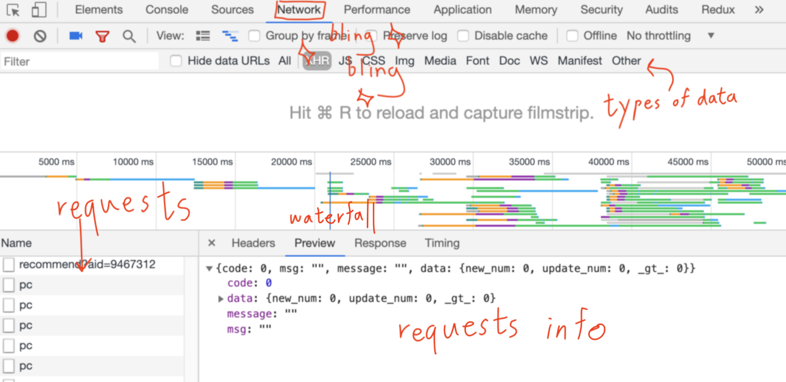
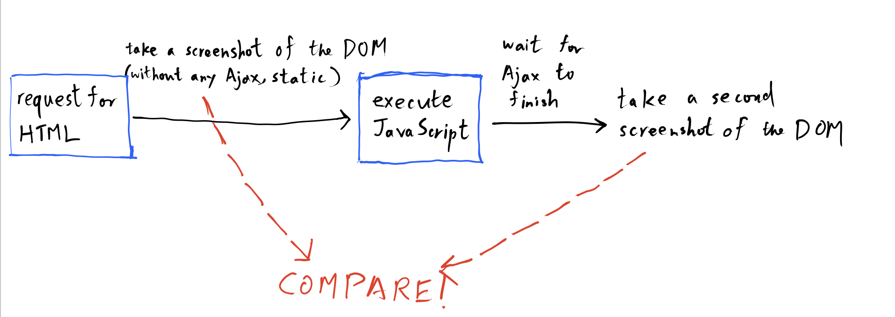

I was asked to analyze the relationship between
search ranking and the amount of 
[Ajax](https://en.wikipedia.org/wiki/Ajax_(programming))
used in the page.
The pages that do not use any Ajax to inject dynamic 
content are called static pages.
Those that do are called dynamic pages.

Regardless of how I derive the relationship, 
the first thing to do is to obtain the answers for 
some questions about one single page.

1. How much impact does Ajax have on the page?
   
To answer this, ideally, we need to know a few things.

2. Are there Ajax used in the page at all?
3. When do Ajax calls finish?

If the answer to 2 is yes, then it is dynamic.
Otherwise, it is a static page.

Question 3 is necessary. If we simply request
for the page and start analyzing it right away
without waiting for the potential Ajax calls 
to add content to the page, then it is pretty pointless.
For instance, you request for Facebook's feed page and 
do not wait for the remote to fetch you the posts before
you start analyzing it. All you will be looking at its
the loading page without the content. 

#### The Answer (as a human)

As a human, we can see the impact of Ajax on the page. 
For instance, when you just open Facebook or Youtube,
it takes a while for the posts and videos to show up. 
However, it sometimes can happen so fast with good 
network condition and fast computer that we barely
see the change. 
But, we can always use the $\mathcal Chrome\;Dev\;Tools$,
which is everybody's favorite.

This is the time where the Network tab shines.



We can see all the network activities,
including the request and response information. 
The Network tab also allows us to filter request based 
on the type of data requested. What we really care about is 
[XHR](https://en.wikipedia.org/wiki/XMLHttpRequest). 
The XHR responses consist of XML (which includes HTML),
[JSON](https://www.json.org/), or other data format that 
can be potentially be placed on the page dynamically.

The waterfall allows us to select a chunk of time 
and looks at all the request and response within the
selected timeframe. The filmstrip is a series of 
screenshots taken to let us see the change in the page
visually.

As a human, we can look at each request and its impact
on the page by looking at the filmstrip. Then, we can
determine how much contents are rendered or dynamically
put on to the page. You may be able to see a problem 
here. It is quite hard to quantify the amount of impact
by Ajax just by looking at the filmstrip.  

So far, we are running into 2 major hurdles. 
1. There is a difficulty to quantify how much Ajax impact
   the page just by looking at the filmstrip visually.
2. This is not scalable. As a human, it will take up 
   too much valuable time to analyze 10 pages. Don't even
   think about 100 pages, or 1000 pages.

#### The Answer (as a machine)

We can easily solve the issue of scalability easily
with computers. They are built for exactly this purpose.


To analyze a static webpage with a machine, we use the 
good old web parser approach. Request for the page, 
get its HTML text. However, since we are looking at pages
with Ajax, we need a JavaScript runtime to run the 
scripts. This problem has been solved with 
[selenium](https://selenium-python.readthedocs.io/),
a browser automation tool mostly used for testing. 
People have been repurposing it to parse pages with Ajax
requests.

Now, we have the tools. Next, we answer the questions
with these tools. Let's first tackle 2. 

> 2\. Are there Ajax used in the page at all? 

As a human, we can inspect the network tab. 
If there are XHR requests that have an impact on the 
[DOM](https://developer.mozilla.org/en-US/docs/Web/API/Document_Object_Model/Introduction) 
(visually), then there is Ajax.
The machine can do the same. It waits for XHR requests 
to finish, then checks if the DOM changed, which is 
way more "accurate" than just visual inspection of the 
filmstrip.



Seems easy enough. 
With a proper DOM compare methodology, we can answer
question 1. 
The only question left is 3. 

> 3\. When do Ajax calls finish?

We need to tell the code when the best time is to 
take the second screenshot of the DOM, which is when
all the Ajax has finished and dynamic content has been
injected into the page.

As a human, this seems like an easy enough issue.
We stare at the network tab until there is no more 
activity. Then, we can claim that all Ajax are done.

However, the same approach seems quite unreasonable to
a machine. The machine cannot look at the network tab
and determine when there is "no more activity". 
It might be able to determine if there are requests 
that have not yet received a response. But, it is quite
hard to know if there will be more requests after 
the current batch of requests is done. 

##### Attempt 1: Explicit Wait 
I turned to StackOverflow and Google for an answer.
The suggested way is to use the 
[explicit wait API](https://selenium-python.readthedocs.io/waits.html#explicit-waits),
which listens for a certain condition in the DOM. 
The code is blocked until the condition is achieved.
Quite dangerous if you think about it. 
What if there was network error and the dynamic
content is not rendered on the page? Your code will be
blocked forever. However, there is an option is to set 
a timeout, which help solves this issue.

Explicit wait fails to address the problem. 
We are looking at unknown pages. We cannot possibly
know where the DOM will be changing for a generic page.

##### Attempt 2: Implicit Wait
Another API that might be useful is the
[implicit wait API](https://selenium-python.readthedocs.io/waits.html#implicit-waits).
It waits for a specified amount of time. 
There are usually 2 problems, whenever our code
specifies to wait for a specific amount of time. 
$(1)$ It is not efficient since the Ajax might be 
done before the timeout. The code will be idle for
the extra seconds, wasting our time. 
$(2)$ Even worse, what if the Ajax is slow and does
not finish before the timeout?

Therefore, implicit wait is not a good solution.

##### Attempt $n$: Random Brainstorming

Well, if waiting does not work, we might have to probe
the DOM or the browser runtime more actively for 
information.

Maybe we can check if the stack is empty.
However, the stack can't really be empty since there 
is always the main event loop function.
So we can check if the stack contains only the main 
event loop function.
But what about the code that is under perhaps a 
`js±setTimeout` call? What about the event listener code? 
For instance, what if all the code are put under 
`js±window.onload`?


Yes, this is getting complicated. That is exactly the 
point. This is a difficult problem. 
It is now a good time to give up on looking for a 
perfect solution.

Instead of blindly looking for a solution,
why don't we consider if the problem is solvable at all?

$\large\textbf{I am going to argue there is no solution.}$

I claim that a solution does not exist.

#### The Halting Problem

Read about it [here](https://en.wikipedia.org/wiki/Halting_problem).
It is a well-known problem that currently has no 
solution. From my algorithm class (CS180), to prove
a problem is unsolvable (in some polynomial time), 
we transform the problem into another known unsolvable
problem. Therefore, we transform our Ajax problem
into the halting problem.

In fact, what we are trying to do is predict when all
Ajax calls finish, which is a subset of the problem
when the program exits.

We imagine one case with the following pseudo-code.
```js
while(true) 
    Ajax();
```

That's it. The `js±Ajax()` function is being put into
an infinite loop. Then, we ask question 3 again. 
We obtain a case where Ajax call cannot terminate. 
One might question if real production code uses an
infinite loop.
The answer is no, but yes.
There is no way that a person will write an infinite
while loop in production code. But someone can
write this.
```js
setInterval(Ajax_and_Update_DOM, 3000);
```
This logically is equivalent to an infinite loop.
These types of pattern occur when the frontend has to
constantly poll from the backend for live updated
information. Libraries such as 
[Socket.io](https://socket.io/) are built for this
exact reason.

One way to think about this is that a machine can never
detect an infinite loop. Therefore, our code can never
__predict__ whenever the code has finished running. 
Checking if the stack is empty is not a way to predict
if the program halts. It is asking if the program has
halted __right now__.

#### Final Solution?

We proved that there is no solution. Great. So what now?
We look back to our seemingly impossible solution,
the Implicit Wait. 

Yes, we blindly wait for the page to load and wish
for something to happens. 
As a human, that is what we do. 
We are good at these type of things, detecting the 
changes and notice the rate of change is slowing down.

#### Measurement of Impact

I have not really thought through how to measure the 
impact of Ajax on the page.

My initial idea is to use the `none±diff` 
(read the [man page](http://man7.org/linux/man-pages/man1/diff.1.html))
program to count the number of lines changed on the page.
There is a problem of minified file. It does not 
really work well with `none±diff` since everything 
can possibly be on the same line. 
One way to circumvent is to use 
[BeautifulSoup](https://www.crummy.com/software/BeautifulSoup/bs4/doc/) 
to print the beautified DOM and compare them. 

Again, I have not really thought through this but 
we will see.

#### Conclusion

In short, predicting if all Ajax has ended is an 
unsolvable problem that we just have to ballpark.
