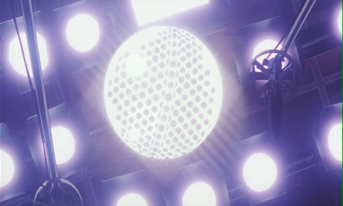
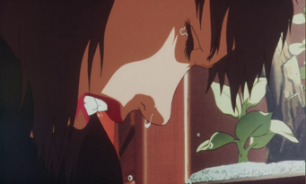
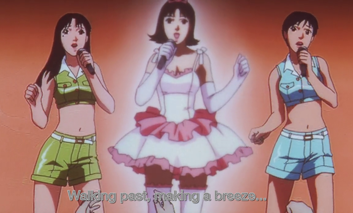
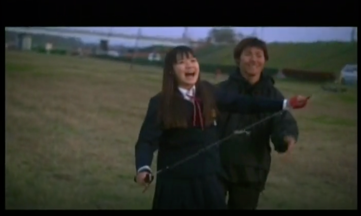
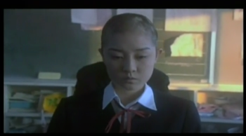
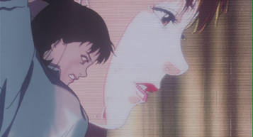
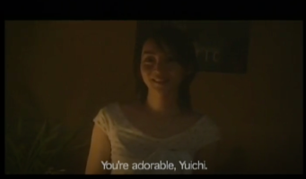
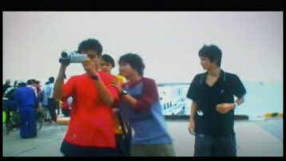

_Disclaimer:
This ariticle was written for a class that I took in UCLA,
Japan 70, during Fall 2019. No one is allowed to use this
work without my authorization or you might violate 
academic integrity._ 

__Before reading__: I make references to some scene of the film
by marking its time in the foramt _(hh:mm:ss)_. For instance, 
_(01:30:05)_ means the scene happens at 1 hour 30 minutes and 5 
seconds from the start of the film.

In this article, we discuss and explore the function and the usage 
of body within the 2 films _Perfect Blue_ and _All about Lily 
Chou-Chou_. The body is the interface for one’s soul, and this is 
also true for the films. The body becomes the grounds from which 
characters stage their powerlessness and assert their ultimate 
control over their bodies. The body also acts as a medium on which 
the characters express their unreachable desire.

_Perfect Blue_ uses Mima’s abuse of her own body as a reflection of 
her lack of power in controlling her life. The first instance of 
her body abuse is her rape scene in the TV show _Double Bind_. She 
appears to be completely fine with the fact, but internally, she 
is extremely disdainful with the choice. The film hinted at her 
uneasiness with a shot from her POV looking up the ceiling of the 
set (_Figure 1_). 

<figure>

<figcaption style="text-align: center;">
Figure 1 00:33:00
</figcaption>
</figure>

Our eyes feel uncomfortable staring at the light directly. We 
feel Mima’s uncomfortableness through the blinding ray of light. 
It resonates with the feeling of suppression that Mima feels when 
she is held down by several men. 
Her agony is later projected outward when she is home and has 
a break down _(Figure 2)_. 
Her loss of control over her body is a reflection of the show 
business having having control over her.  Her attitude is clear 
that abusing her own body is undesirable, but she has no choice 
but to give up her body in exchange for her career prospect, 
more so, to buy her time to solidify her role as an actress. 
In the photo shooting scene, the same pattern of abuse is 
re-enforced by the film. The scene is also interlaced with the 
performance of the rest of the 2 members of "CHAM!". 
The lyrics of the song that they are performing can be 
interpreted to indirectly reflect Mima’s suffering: “I’d rather 
wear jeans, than tight business suits” _(45:20)_. Ironically, 
the “business suits” that suffocates Mima is her nakedness for 
the show business. It is as if Mima is singing the song to 
express her strong desire to break free from the abuse of her 
body. Through Mima’s abuse of her body, the film shows the power 
that the business has over her, and also her internal conflict 
between dignity and career.  

<figure>

<figcaption style="text-align: center;">
Figure 2 00:36:47
</figcaption>
</figure>

Interestingly, in a later shot, the creepy security guard 
actually imagines Mima on the stage performing as well. I 
personally think this is an intentional choice made to 
associate the lyrics with Mima’s current mental state 
(_Figure 3_). 

<figure>

<figcaption style="text-align: center;">
Figure 3 00:46:50
</figcaption>
</figure>

_All about Lily Chou-Chou_ also uses body as a mean to portrait 
the characters’ control and power. The obvious example is the 
exploited body of Shiori. She is blackmailed by Hoshino with 
her nudes and therefore has to “sell her body”. Another instance 
is when Yōko is raped by Hoshino’s gang. They are clear 
manifestations of the power Hoshino has over them. Perhaps what 
is more interesting is how Shiori and Yōko assert control over 
their body and thus over their life. Shiori committed suicide at 
the end _(1:57:16)_. We can interpret her death in 2 ways, either 
as the most extreme form of body mutilation, or as a way to free 
her body. If we take the first interpretation, then Shiori’s act 
of killing her body is an absolute demonstration of power that 
Hoshino has over her. However, the second interpretation is more 
convincing if we also examine the scene where she flies the kite 
right before her death _(Figure 4)_. 
She is taught how to pull her arm down to give momentum to the 
kite. Each time Shiori pull her hands down firmly, it is an 
assertion of control that she no longer has over her body. When
she declares she “want to ride on a kite” and “fly in the sky”,
the film foreshadows her suicide _(1:56:58)_. The dialog shows 
Shiori’s urge for freedom. 

<figure>

<figcaption style="text-align: center;">
Figure 4 01:56:14
</figcaption>
</figure>

With Shiori, the film attempts to 
show her control over herself with the devastation of her 
exploited body. On the other hand, Yōko chose a different way 
to cope with the assault done to her body. After she is raped, 
she cut all her hair and become bald _(Figure 5)_. 
In this sequence, all students stared at Yōko’s new hairstyle.
It seems that the bald haircut is a public declaration from Yōko
to assert her control over her body. In this shot, Yūichi sits 
behind Yōko, and when Yōko came into the frame, her head and 
upper body covered up Yūichi, who is a culprit of the crime. 
The visual arrangement here suggests Yōko tries to cover up the
abuse to her body through another “abuse to her body” of 
cutting her hair, further exemplifies the use of body to assert 
power, not only over other people, but also over oneself. 

<figure>

<figcaption style="text-align: center;">
Figure 5 01:50:15
</figcaption>
</figure>

Both films use the body as a stage for the characters to 
dispatch their control either over somebody else, or over 
themselves. But in addition to asserting their power, the 
characters enact a genuine desire to avoid engaging in the arena 
of power dynamics at all, but instead to seek security through 
the body. Next, we turn our attention to the characters’ 
display of their desire fantasy and expectation for a certain 
body, which is is highly linked to their emotional desire as well. 

In _Perfect Blue_, Rumi creates a virtual body of Mima online 
that fits perfectly into her expectation of who Mima should be. 
According to the blog, the virtual Mima is struggling with her 
rape scene, since she (Rumi’s imagination of Mima) called the 
producer a “total pervert” _(37:39)_. Although those are not 
Mima’s actual word, it aligns with her disgust with the rape 
scene, as analyzed above. Mima is also confused and misled by 
the virtual image of herself on the blog. There is an 
expectation and a wish for the “purity” of Mima’s body here, 
coming from both Mima and Rumi. We focus on Rumi’s desire here. 
Rumi seeks security of having the old pop idol Mima image. 
Therefore, she attempts to fulfill her crave for the old Mima 
image through “living” in the virtual Mima’s body. Later, her 
desire grows so strong that she exhibits her desire for the 
comfort zone of the pop idol image through physical action. 
Particularly, we look at the scene when Rumi murders the 
photographer who took the nudes for Mima. Before the film 
reveals Rumi as the murderer, the scene intentionally does
the murder through “Mima’s body” _(Figure 6)_. It can be 
understood as Rumi seeks comfort in Mima’s pop idol image 
through using Mima’s body to do the murder thus “her Mima” 
fits the expectation of her, maintaining her pop idol image. 
This message is enforced by the projector screen showing a 
picture Mima. The innuendo here is the Rumi’s imaginary 
projection of her expected Mima’s body is doing the stabbing. 
Therefore, through a mix of the virtual and physical body of 
Mima curated by Rumi, the film shows the Rumi’s extreme 
sickening content to stay within Mima’s pop idol image. 

<figure>

<figcaption style="text-align: center;">
Figure 6 00:57:04
</figcaption>
</figure>

<figure>

<figcaption style="text-align: center;">
Figure 7 00:38:51
</figcaption>
</figure>

_All about Lily Chou-Chou_ also paints the teenagers’ wish 
for security through their creates a desire for the body of 
a mother. As Professor Kanesaka has mentioned in class, the 
story of the film revolves around a bunch of 14-year-old. 
The reason behind the intentional selection of this age 
group is that they are faced with a decision to either keep 
studying in high school, or just stop after finishing middle 
school. There is an insecurity that is associated with the 
age of 14. When Yūichi first visits Hoshino’s house, he 
displayed some desire what might be misinterpreted as “sexual
interest” towards Hoshino’s mother. He purposely uses the 
shampoo of Hoshino’s mother _(38:27)_. Using somebody else’s 
shampoo represents an indirect physical contact with the 
person’s body. It shows Yūichi’s urge to achieve intimacy with 
Hoshino’s mother. The film also allows the viewers to feel the
intimacy through Yūichi’s POV. In the same shower scene, 
Hoshino’s mother opens the door and talks to Yūichi 
face-to-face even though Yūichi is naked in the bath tub. 
Immediately after the shower scene, the shot is in the 
perspective of Yūichi _(Figure 7)_. 
The light is low, having her face half lit in a very intimate 
setting of a bedroom. All these shots let us see the mother’s 
attractiveness to Yūichi. At this point, Yūichi thinks that 
the female is Hoshino’s sister. Therefore, it is confusing to 
him, and also the viewer, that he has this almost sexual feeling 
towards someone’s body. Later, Hoshino clarified that the female 
is actually his mother _(39:06)_. At this point, the film is 
trying to relate teenagers’ sexual lust to a maternal figure. 

<figure>

<figcaption style="text-align: center;">
Figure 8 00:54:03
</figcaption>
</figure>

 

The next instance when the teenager displays their desire towards
a female body is when they are in Okinawa. The boys are fighting 
over the video recorder so they can film the body of the female 
tour guides _(Figure 8)_. 
How does this have anything to do with the maternal figure and 
ultimately the crave for security of teenagers then? The answer 
lies in the conversation they have with the hitchhiker: 
“Okinawans say man was made from woman’s rib. So women here are
very powerful.” _(54:39)_ Here, the notion of women giving birth 
or creating men’s body is being mentioned. This serves as a link 
between mothers’/women’s strength and their body. Women are 
being described to be a reliable figure here, not only from the 
saying, but also from the fact that their tour guides, who 
tourists have to depend on so they do not get lost, are girls. 
After, their trip to Okinawa, Yūichi starts to get bullied by 
Hoshino, getting involved in this entire power dynamics circle. 
During this time of uncertainty and insecurity, the teenagers 
(including Yūichi and Hoshino) seek comfort in Lily’s music. 
Yūichi, as Philia, says that Lily “conceives and give birth to” 
her music, and “the Ether is the amniotic fluid” _(25:10)_. Tying
 all these strings together, we see that the teenagers are 
 looking for security inside a mother’s body, which is reflected
 through their sexual interest in women’s body. The security of 
 being a mother’s womb, in which all of the baby’s need are being 
 catered to perfectly, is what the teenagers in the power struggle 
 are after. The mother offers the protection the baby needs. 
 Therefore, the film describes their craving for security through 
 their interest in a maternal body.

In conclusion, both the _Perfect Blue_ and _All about Lily Chou-Chou_ plays with the notion of body to reflect their manipulative relationships with their influences over their body, and to show the desire of staying away from such distorted relationships. 

 