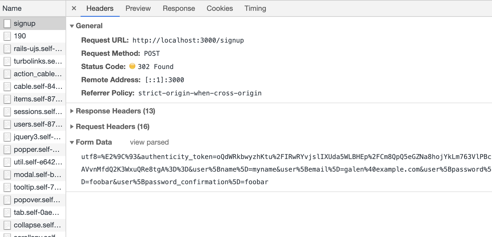
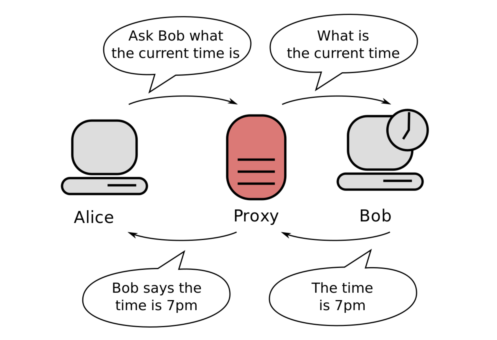
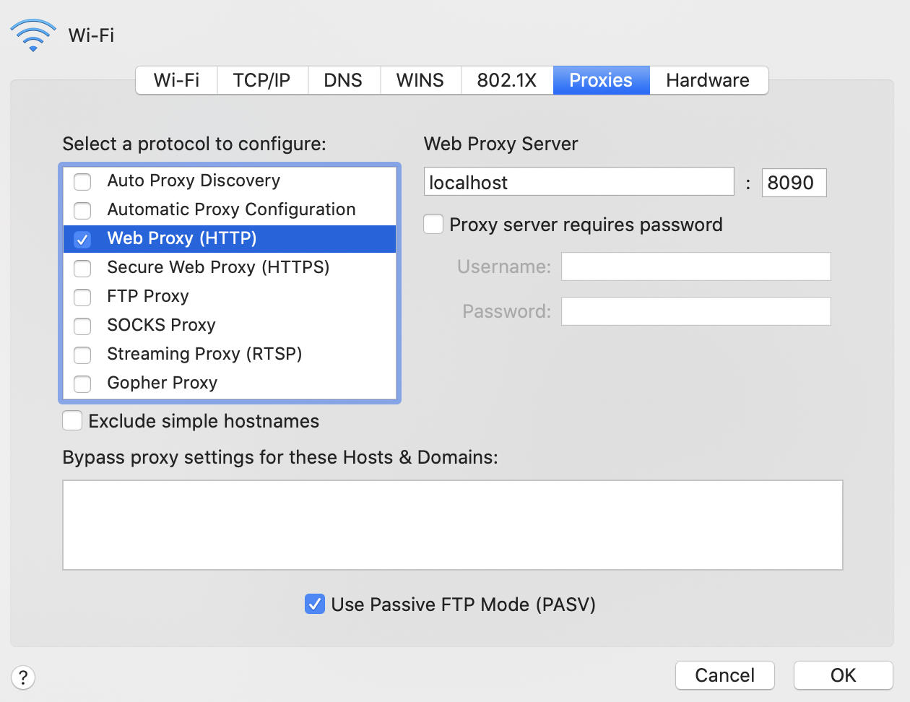

In one of the class I took in UCLA this quarter, 
we had to use [Tsung](http://tsung.erlang-projects.org/user_manual/index.html)
as a load testing tool to load test our web application. 
We first deploy our app on AWS. Then, we obtain another
AWS instance to run the Tsung test script. The problem
with that set up is that debugging the test script is 
challenging, since we cannot change our web app to 
output debug information easily, and Tsung is not 
easy to debug as well. Therefore, I set it up locally 
to have it working. 

Other than the difficulty of debugging, the other 
challenge that I ran into is to upload an image with
Tsung. In our web application, we used `multipart/form-data`
to upload the image.

In this article, I will describe how I set up Tsung 
on my local (macOS), and how I used `tsung-recorder` to work
with image upload. 

- [Installing Tsung](#installing-tsung)
- [Configuring Test XML Script](#configuring-test-xml-script)
- [Problem with `multipart/form-data`](#problem-with-multipartform-data)
- [Tsung Proxy Recorder](#tsung-proxy-recorder)
  - [What Is A Proxy?](#what-is-a-proxy)
  - [Using Tsung Recorder](#using-tsung-recorder)
  - [Configure macOS to Use Proxy](#configure-macos-to-use-proxy)
  - [Bypassing Chrome's `localhost` No Proxy Policy](#bypassing-chromes-localhost-no-proxy-policy)
- [Gotchas in Test Script](#gotchas-in-test-script)

## Installing Tsung

We can install Tsung using homebrew. 

```
brew install tsung
```

This is going to install `tsung`  and `tsung-recorder`.
Then, we are good to go.

## Configuring Test XML Script

Since all the set up is done locally, our app server
will be on the same machine as our tsung test. 
For this to work, we want to set our test script
to hit our application at `localhost`. 

```xml
<!-- Server side setup -->
<servers>
  <server host="localhost" port="3000" type="tcp"></server>
</servers>
```

Here, my web app server is set up on `localhost:3000`. 

## Problem with `multipart/form-data`

Back when our app was simple enough, all the POST
endpoint only contains textual data. 
Therefore, we can use `x-www-form-urlencoded` to 
send our data. In Chrome DevTools, you can view 
the raw HTTP body that is being sent to the server.
For instance,



If so, we can simply copy the content of the 
form data from the DevTool, and paste them into the 
test script in the XML.

```xml
<http url='/signup' version='1.1'  contents='user%5Bname%5D=test_name&amp;user%5Bemail%5D=test%40gmail.com&amp;user%5Bpassword%5D=fdsafdsa&amp;user%5Bpassword_confirmation%5D=fdsafdsa&amp;commit=Create+my+account'  method='POST'>
</http>
```

`x-www-form-urlencoded` does not support 
raw binary file upload. We want to use `multipart/form-data`
instead. When I upload a form without an image,
we can see it in the DevTool.


You can still copy and paste the content by clicking
on `view source` and put them into the XML. 
However, `multipart/form-data` requires the body to 
use CRLF line ending. Simple copy and paste might use
just LF as line ending and might not work. 

However, the bigger problem is that when we select 
a file to upload, we cannot see the raw output from the 
DevTool. 


This make sense from the perspective of the user experience 
of Chrome DevTools. Showing the binary is going make the UI 
slow and displaying the binary is not useful to the users as 
well. 

Since we cannot simply copy and paste from the DevTools,
we need another solution.

## Tsung Proxy Recorder

Tsung is aware that manually capturing the network
transaction and turning them into XML is a lot of 
manual labor. Therefore, they provide a proxy recorder
to simplify the process called `tsung-recorder`.

### What Is A Proxy?

Before we start using `tsung-recorder`, we need 
to understand what a proxy is. 

A proxy is simply a "man-in-the-middle". If you
use a proxy service, all the network traffic will 
be forwarded to the proxy server. The proxy server will 
handle all the network traffic for you and return the 
appropriate response.




> From: https://en.wikipedia.org/wiki/Proxy_server


### Using Tsung Recorder

Tsung recorder is a special proxy server that captures all 
your network traffic and record them in the format of XML 
that can be executed by tsung as a test script. 

To start the test script, we use 

```
tsung-recorder start
```

Now, a proxy server is set up and listening traffic from 
the port 8090 (default).
And the recorded XML file can be found in `~/.tsung` (default).

Just a side note, to shut down the proxy server and 
stop recording, technically you use 

```
tsung-recorder stop
```

However, on macOS, `tsung-recorder` for some reason cannot
see the other `tsung-recorder` process and shut them down.
The only way that I was able to shut them down is by 
looking for the PID and use `kill`.

```
ps aux | grep tsung
```

### Configure macOS to Use Proxy

Now we know have the proxy server set up. We configure
our system to forward its traffic to the proxy server. 
The setting of proxy can be found at
_System Preferences > Networks > Advanced > Proxies_.

We want to configure the Web Proxy to talk to server
at `localhost:8090`.



> Do not forget to hit apply after changing the proxy
> setting.

Now, if you go to the browser, and navigate to pages
that uses `http`. You should be able to see the traffic
being recorded in the file 
`~/.tsung/tsung_recorderXXXXXXXX-XXX.xml`. 

Note, if you navigate to pages that uses `https`, the 
traffic cannot be recorded. Can you think of why a 
simple HTTP proxy server cannot use HTTPS? 

Now, you are very excited to hit the endpoint on 
`localhost:3000` in your browser, and have tsung-recorder
to record your complex multipart form POST request. 
But you soon realize that it does not work. 
Any traffic to `localhost` is not recorded by 
tsung-recorder. What is the reason?

<details>
<summary>
Click to see why
</summary>

For HTTPS, the traffic is completely encrypted, including the 
header, which contains essential information for the proxy
to forward the request from and to the client.

There is HTTPS proxy, but `tsung-recorder` is not one of them.
</details>

### Bypassing Chrome's `localhost` No Proxy Policy

Turns out, Chrome (and Firefox) has a policy where if 
the host is `localhost`, the browser will not use the proxy.
Instead, it directly send the request to the port without
passing it the proxy. Can you think of why?

<details>
<summary>
Click to see why
</summary>

A proxy server might not be on the same machine 
(not `localhost`). Then forwarding traffic to the host
`localhost`, which is DNS resolved on the remote machine 
means we are not sending traffic to the web app on our machine.

</details>

A way for us to bypass that is to alias the address `127.0.0.1`
with another domain name. We modify the `/etc/hosts` file.

```
127.0.0.1   my.fake.domain.com
```

By adding the line in the `/etc/hosts` file, we can now access 
our application at `my.fake.domain.com:3000`.
And since we are no longer using the host name `localhost` to 
access our web app, the traffic are being forwarded to the 
proxy server (tsung recorder). Therefore, all your traffic
is now recorded!

To simulate a file upload, you simply do what your user do. 
Navigate to your web app (with the fake domain), and use 
the web UI to upload the file. We can than go to `~/.tsung`
to see the output XML file. For a POST request with file 
upload, you might find

```xml
<request>
<http url='/items' version='1.1'  contents_from_file='/Users/galenw/.tsung/tsung_recorder20191121-2355-1.bin' content_type='multipart/form-data; boundary=----WebKitFormBoundaryZePexFw6eX9E0kPZ' method='POST'>
  <http_header name='Accept' value='text/html,application/xhtml+xml,application/xml;q=0.9,image/webp,image/apng,*/*;q=0.8,application/signed-exchange;v=b3' />
  <http_header name='Accept-Encoding' value='gzip, deflate' />
  <http_header name='Accept-Language' value='en-GB,en;q=0.9,en-US;q=0.8,zh-CN;q=0.7,zh;q=0.6,zh-TW;q=0.5' />
  <http_header name='Cache-Control' value='max-age=0' /></http></request>
```

The most important thing to see here is the `http` tag. 
It has attribute `content_type` being `multipart/form-data`,
and `contents_from_file` referencing some binary file with
the extension `.bin`. 
If you read the binary file, you will see it is the body
of our POST request. Now, you have captured a POST request
with file upload. Then, you can use this in your test script 
with no problem!

## Gotchas in Test Script

Very likely that your test script uses some sort of dynamic
data, such as user id that depends on the previous request.
Then, you will use 
[dynamic variable substitution](http://tsung.erlang-projects.org/user_manual/conf-advanced-features.html#dynamic-substitutions) 
to solve the issue. This is done by turning substitution
on in the `request` tag.

```xml
<request subst="true">
```

However, during my testing, my test script gives error,
for reason related to memory overflow. The reason is that 
Tsung is trying to go through the entire content of the 
binary file to look for substitution pattern. 
This requires way too much memory. To avoid that problem, 
you can set `subst` option to ignore the body of the request.

```xml
<request subst="all_except_body">
```

Do not forget to undo your proxy setting and remove the 
alias from your `/etc/hosts` file after you are done!
