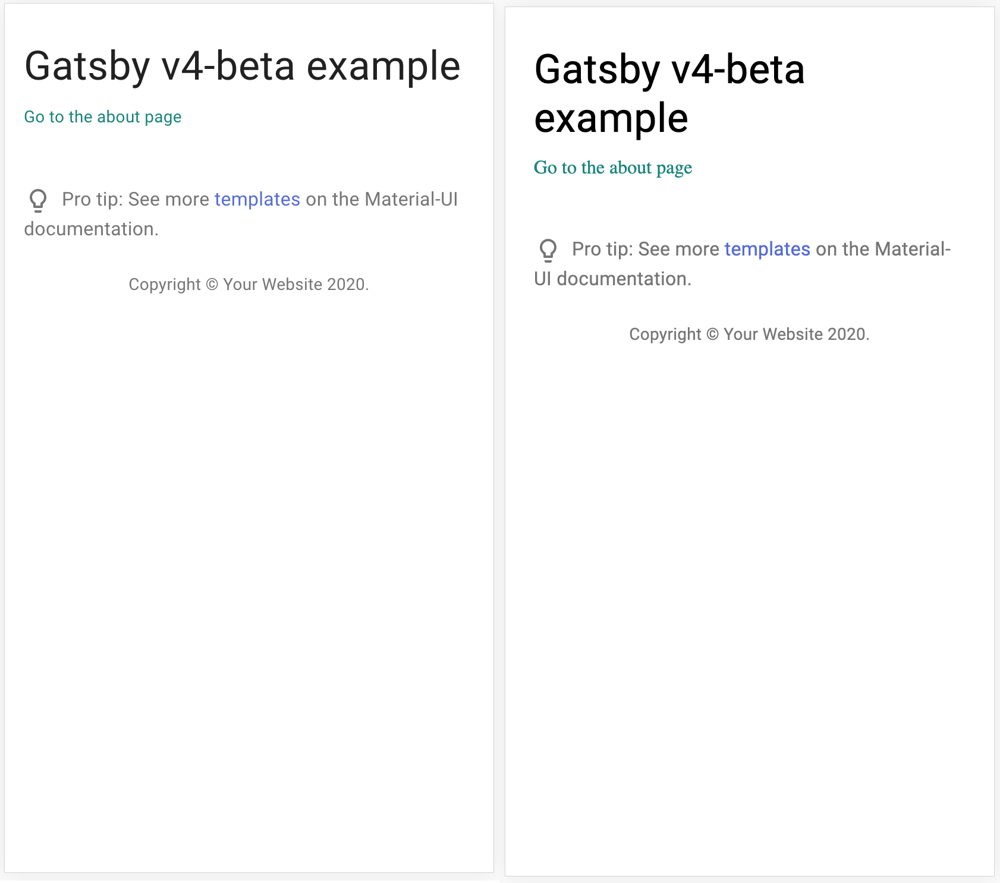

> TLDR: you should move your theme provider into its 
> our plugin. [Jump to the resolution](#conclusion-finally-mastering-the-jutsu).

This blog is built with Gatsby, as I have explained 
in [my earlier blog post](/blog/2019-09-11-first-blog).
To handle the styling, I chose [Material-UI](https://material-ui.com/)
(MUI). I chose it since I like the $\text{NiCe leVEl of AbStRacTiOn}$
it offers to manage style changes within JavaScript. In
its implementation, it uses [JSS](https://cssinjs.org/react-jss/)
to support the feature. It ensures that the theme of 
the website is more unified by using a theme object, which
is a React context that runs through the entire React 
virtual DOM tree to allow all components to access the theme
and create styling that is coherent with the overall design.

```jsx
<ThemeProvider theme={myCustomTheme}>
  {/* the rest of the entire website... */}
</ThemeProvider>
```

Another perk with Material-UI is that although the CSS
are now being controlled in JavaScript, which is suppose
to make style rendering on the server side difficult,
the library supports SSR (server side rendering) of 
styles straight out of the box. It ideally should work 
really well with Gatsby. To enable SSR of MUI styling, 
we add the helper plugin

```js
// gatsby-config.js

module.exports = {
  plugins: [`gatsby-plugin-material-ui`],
};
```

When it comes to dealing with components that is shared
across all pages, we will ideally want to adhere to the
[DRY principle](https://en.wikipedia.org/wiki/Don%27t_repeat_yourself)
by not having to wrap all pages that we code with the
`ThemeProvider` component.
Gatsby offers a nice way for us to factor out the 
common components from each pages through the 
`gatsby-browser.js` and `gatsby-ssr.js` file. 
We can implement the `wrapRootComponent` function
as such

```jsx
// gatsby-browser.js / gatsby-ssr.js
export const wrapRootElement = ({ element }) =>
	<ThemeProvider theme={myCustomTheme}>
		{element}
	</ThemeProvider>;
```

As explained in the [docs](https://www.gatsbyjs.org/docs/browser-apis/#wrapRootElement),
"this is useful to set up any Provider components 
that will wrap your application." This is
exactly what we want. Now, we can sit tight and enjoy 
the easy MUI SSR benefit. Right?

## Problem with SSR-ing of MUI Theme

Not so fast, in early iteration of this website, 
we find the following bug in the production build
(generated from the command `gatsby build`). 
The following gif shows how the old version of 
my blog renders under a 6x CPU slowdown:

<figure align=center>


<figcaption>

  _Initial Render under 6x CPU slowdown_
</figcaption>
</figure>

I want to point out the flash of font.
In CSS, we call this flash of unstyled content (FOUC). 
Multiple factors can lead to FOUC. Common causes are
loading of external CSS stylesheets and external fonts.
In my website, I use external fonts from Google Fonts.
However, I only slowed down my CPU in the test and did
not toggle with the network throttle setting at all. 
There might be something else that is causing the issue.

The font of the titles are controlled by the MUI theme. 
The next idea that I had is to check whether my CSS in 
Material UI is being properly SSR-ed. To do so, we prevent
JavaScript from running. The reason to disable JS is that
if style is properly SSR-ed, we should still see the font
being loaded properly after some delay. However, if 
style is not SSR-ed, we will not even see the correct font
at all. Since Javascript cannot be executed, the font style 
cannot be mounted into CSS in run time. 

> To disable JavaScript, you can
open Chrome DevTools, and hit 
<kbd>Cmd</kbd>+<kbd>Shift</kbd>+<kbd>P</kbd> 
(<kbd>Ctrl</kbd>+<kbd>Shift</kbd>+<kbd>P</kbd> on Windows).
This will open a command dialog and search for the option
_Disable JavaScript_. 

After disabling JavaScript, we re-render the page. This is
the result of rendering without JavaScript.

<figure align=center>


<figcaption>

_Initial rendering with JavaScript disabled_
</figcaption>
</figure>

<figure align=center>


<figcaption>

_Left: Rendering with JS, Right: Rendering with JS disabled_
</figcaption>
</figure>

We see that the font is not correctly being loaded.
The navbar is using the default system font. 
By inspecting the CSS properties on the navbar, 
we see that Material-UI font styling is not SSR-ed. 

What is going on here? Is the MUI plugin broken such
that it is not rendering the styling? When MUI renders 
the styles, it injects the CSS into a `style` tag in the 
`head` tag, with the ID `jss-server-side`.
However, this `style` tag will be unmounted as soon
as the JavaScript runs since we want the JavaScript
styling to determine the actual styling. It is 
there to prevent the FOUC problem between the webpage
loads and when JavaScript runs.
After checking, the `jss-server-side` style is there. 
Therefore, MUI should be able render the CSS properly. 

> Note that this behavior can only be found in production
> build, in which a static website is generated. This behavior
> cannot be replicated in development mode. If we disable
> JavaScript in development, we cannot access our site 
> due to the fact that our site is hosted in a webpack
> dev server which requires JavaScript to run and 
> access the site.

## How the Official MUI Gatsby Example Handles Theme

I decided to check out the official MUI Gatsby example 
to see how they handled global theme styling. 
We can find the example [here](https://github.com/mui-org/material-ui/tree/master/examples/gatsby). 
Interestingly, we see that they have written a custom
plugin (`gatsby-plugin-top-layout`) to support theme injection. 
Inside the plugin, we find a implementation of `wrapRootElement`:

```jsx
import React from 'react';
import TopLayout from './TopLayout';

export const wrapRootElement = ({ element }) => {
  return <TopLayout>{element}</TopLayout>;
};
```

In side `TopLayout.js`, we see that it wraps the children
within a `ThemeProvider`.

```jsx
<ThemeProvider theme={theme}>
  {/* CssBaseline kickstart an elegant, consistent, and simple baseline to build upon. */}
  <CssBaseline />
  {props.children}
</ThemeProvider>
```

This simply means that we are moving the theme wrapper
from our root `gatsby-browser.js` into a plugin. 
When we try building the page (remember to build the
page not in development mode), the styling works
fine with the theme styling correctly injected.
However, why does this matter? 

To understand the reason, we take a look at the order 
of plugins specified in the `gatsby-config.js` file for
the example repo. 

```js
module.exports = {
  plugins: [
    'gatsby-plugin-top-layout',
    'gatsby-plugin-material-ui',
    'gatsby-plugin-react-helmet',
  ],
  siteMetadata: {
    title: 'My page',
  },
};
```

Interestingly, we see that the plugin that wraps
our page in a theme provider (`gatsby-plugin-top-layout`)
goes before the plugin that actually does the SSR
of style (`gatsby-plugin-material-ui`).
What happens if you switch the order of plugin and
have `gatsby-plugin-top-layout` goes after?

<figure align=center>



<figcaption>

_Left: Built with `top-layout` before (correct behavior)._\
_Right: Built with `top-layout` after (incorrect behavior)_\
Both rendered with JavaScript disabled. 
</figcaption>
</figure>

> The exact steps taken to reproduce the buggy behavior:
> 1. Clone the Gatsby MUI example (don't forget `npm install`)
> 2. Switch the order of `top-layout` and `material-ui` plugin
> 3. `gatsby build`
> 4. `gatsby serve` and navigate to the page with JavaScript disabled.


Ha! The ordering of plugins does matter here. 
The order of plugin specified within the `gatsby-config`
file is the order in which Gatsby executes the 
plugin during the build stage. 
Therefore, the order of how the components are
wrapped are also determined by this ordering. 
Let's assume that we have the following ordering of plugins.

```js
module.exports = {
  plugins: [
    'gatsby-plugin-1',
    'gatsby-plugin-2',
    'gatsby-plugin-3'
  ]
};
```
Let us also assume that all of them implements the 
`wrapRootElement` API and wraps some components
around the element. The order of how the components
are wrapped is like the following:

```jsx
<RootWrapper>
  <Plugin3Wrapper>
    <Plugin2Wrapper>
      <Plugin1Wrapper>
        {children}
      </Plugin1Wrapper>
    </Plugin2Wrapper>
  </Plugin3Wrapper>
</RootWrapper>
```

> Note that the `RootWrapper` is the wrapper component
> specified on the top level `gatsby-browser.js`.

If the the material UI plugin comes first, we will have
the following structure.


```jsx
<ThemeProvider>
  <MuiSsrPlugin>
    {children}
  </MuiSsrPlugin>
</ThemeProvider>
```

The `MuiSsrPlugin` (hypothetical name) is the component 
that takes the descendant nodes to render their style 
and inject them into the html build. However, since 
the `ThemeProvider` is not a child of the `MuiSsrPlugin`, 
whatever styling that it contains will not be rendered 
on the static build. 

In our case, since the root wrapper is the last thing that
wraps the entire React DOM tree, the `MuiSsrPlugin` can
never render its style correctly!

## Conclusion: Finally Mastering the Jutsu
> <h3> 
> 
> Me: $\mathcal{Omae\ wa\ mou\ shindeiru}$\
> Bug: $\mathcal{NANI?}$ 
> </h3>
> 
> Meme reference: https://www.youtube.com/watch?v=dNQs_Bef_V8

To conclude, the main reasons that SSR does not 
work in the website are:
1. The `MuiSsrPlugin` only SSR styles of its descendant nodes
2. The `wrapRootElement` in the top level `gatsby-browser` is always 
   executed last. 

Again, to re-iterate, the most important take away here 
is that the order of plugin specified in `gatsby-config`
is the order in which they execute. The solution is that
we extract our theme into a custom plugin. To see
how I implemented that, you can check out this commit: 
[226fff20](https://github.com/GalenWong/galenwong.github.io/commit/226fff203d3a67ac8d813ed3df9cd1f6f0bdb7df).
