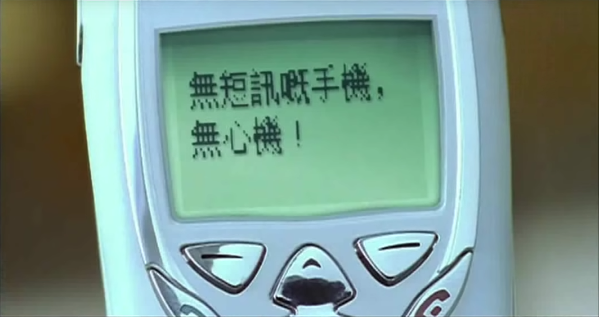

YouTube這個平台，可以說是我對台灣文化的首次接觸。其實並不是我刻意去尋找有關台灣文化的影片，而是當時用普通話作為語言的創作者大多數來自台灣，我也就從這一群操有帶有獨特韻味國語的創作者們了解到了兩岸用語上的差異，從而也延展到文化層面上的了解。

這幾年來不知為何，我的YouTube推薦充滿了來自台灣的音樂，可能是我突然興起想回憶周杰倫的韻味，才讓演算法嗅到了我骨子裡的閩南基因（註：我父母親是福建人）。也就因此我愛上了許多台灣的獨立樂團，從我的[簡介頁面]()也可以看的出來，美秀集團，好樂團，老王樂隊，茄子蛋。聽著音樂做作業，也沒有精力去注意歌詞在說些什麼，更不用說MV的內容，也許也是因為一切都那麼自然，熟悉的語言，聽過許多遍的旋律，也是令我忽略的歌曲裏的種種。

在2019年暑假的時候，有幸踏足在對岸熟悉又陌生的的寶島，故意擺出從台灣YouTuber們學來的口音，把賣滷肉飯的阿姨叫做「 ǎ yí 」（註：通常我讀一二聲），把台北車站熟練的稱做「北車」，只為更加融入這個地方，讓這個地方更加信任我，願意把她的秘密全盤托出。也是為了對陪伴我度過作業的音樂人們表達謝意，去了音樂行購買了許多張實體的專輯。

在旅行的尾聲，我去了一趟台北當代藝術館（MOCA Taipei），本來期待著像洛杉磯當代藝術館（MOCA LA）同等級的視覺聽覺衝擊，最後我帶走的卻是一場反思，對香港文化的反思。

當時的展覽主題是「少年當代」，從名字可以得知，這是藝術家們對他們少年時代的回憶。文字真的很有趣，當代的「當」字賦予了一層回憶感，如果標題為「少年時代」，就失去了這一層回顧的意境了。

<figure align=center>

<figcaption>
「少年當代」展覽海報
</figcaption>
</figure>

當天也剛好遇上了藝術家講座，本來我的動機實在單純，既然給了票錢，就要聽聽這藝術家講的話，讓自己受到藝術的薰陶，提升我膚淺的思想，聽不懂也要裝聽懂，實在是被「[你要不要吃哈密瓜](https://www.youtube.com/watch?v=TRDV0xw3j4Y)」所點名批評的哪一種人。坐下的時候，一位名字叫陳泓易的先生在台上講話，講著關於他自己身為台灣人在八十年代的經歷。指著投影片上的港劇「楚留香」，他開了一句玩笑說「沒有他我們就不能變大人」，台下的觀眾，除了我，都笑了出來。我無法完全跟上他們的幽默，畢竟我不是同一個年代的，但之後所帶到的一句話卻引起了我的好奇：「在『楚留香』之後，我們都變大人，我們都變現代了，我們都跟香港掛勾了。香港那個美好世界，現代化的亞洲樣板，我們就連結上去了，之後的台灣，就好像跟香港有了關係」。自覺對香港十分了解的我，聽了陳老師話語中透露出對香港文化的崇拜實在迷惑，這幾年來實在感受不到香港的文化輸出。

<figure align=center>
<iframe width="560" height="315" src="https://www.youtube-nocookie.com/embed/x4tNe_Q97ps?start=5584" frameborder="0" allow="accelerometer; autoplay; encrypted-media; gyroscope; picture-in-picture" allowfullscreen></iframe>

<figcaption>
藝術家講座錄像，陳泓易老師的片段，我當時就坐在台下
</figcaption>
</figure>

引用我朋友的一句話說：「香港除了陳奕迅真的沒有其他好歌手了。」我並不是對現在香港的樂壇進行全盤否定，而是想說明在我的年代，香港的文化輸出真的一言難盡。我會說這一番話，也是因為沒有對比就沒有傷害，我回想小時候的電視台還會在晚上十點開始播放周星馳，周潤發的電影，福建老家的親戚們也都很享受《賭神》和《整蠱專家》這一類港片，遠在北京的朋友也有聽過《千千闕歌》這首經典粵語歌曲。相比這幾年來，大家可能再也不知道粵語樂壇裏誰出了新歌，有什麼新的港片，有誰的八卦。仔細想想，香港明星的身影其實從未消失在大陸觀眾的眼中，現在的香港藝人可以說是殺出了另一條血路，王祖藍，鄧紫棋，陳奕迅也是經常出現在大陸的綜藝節目裏，可是除了他們的粵語口音，好像並沒有展現香港的文化。此篇文章的重點不再這裡，我不會過多的進行討論，但以上的反思，也讓我感受到了在上一個年代香港影響力巨大的娛樂產業，對外傾瀉著文化輸出。

陳泓易老師提到八十年代香港文化對台灣的影響，我無法直觀的感受到，可讓我驚喜的是，我開始在我聽的音樂中找尋到了蛛絲馬跡————八十年代烙印在台灣藝術家心中的香港味，也在近代（指近二十年）的台灣流行歌曲中滲透出來。

## 周杰倫

在周杰倫幾首歌的MV裏，有著粵語的對白。

<iframe width="560" height="315" src="https://www.youtube.com/embed/kLY11fv7fUk" frameborder="0" allow="accelerometer; autoplay; encrypted-media; gyroscope; picture-in-picture" allowfullscreen></iframe>

在《你聽得到》的MV裏，手機精靈這個角色就是講粵語的。不過手機精靈這個角色很突兀，中間穿插聲色短信的功能介紹跟背景的歐式建築搭配起來也是十分奇怪了。另外三首MV裏有粵語的歌曲是[《園遊會》](https://www.youtube.com/watch?v=IoCoIxkGkVw)、[《回到過去》](https://www.youtube.com/watch?v=MKNrnSsIwf8)和[《浪漫手機》](https://www.youtube.com/watch?v=Kbvu9Vt5_eE)，這四首MV裏的共同點就是他們都和手機有關係。我特別想分享把《回到過去》裏的短信。

<figure align=center>

<figcaption>
女主發給男主的短信：「扮COOL危害健康。」
</figcaption>
</figure>

「扮COOL」這句話可以說是非常有香港味了，普通話/國語通常會用「裝酷」來形容，女主在MV裏的設定是說粵語的，用香港用詞發短信也是合情合理，但是另一條男主發給女主的短信就很「好笑」了。

<figure align=center>

<figcaption>
男主發給女主的短信：「無短訊嘅手機，無心機！」
</figcaption>
</figure>

這一句話是香港的口語說法，放在書面語來說的意思是「沒短訊的手機，沒心機」。這一句話應該是男主給女主發送的冷笑話，雖然我懂粵語但這個冷笑話我是一點也看不懂，沒有短信的手機跟沒有心有什麼關係嗎？我能想到最接近的諧音就是國語的「短信」（不是短訊）跟心了，雖然說拼音一樣但是音調也不同。如果有人能看懂這個梗請務必跟我解釋。

剛剛也提到，這四首歌的MV都跟手機有關係，手機的元素某種程度上也是跟歌曲本身有些格格不入，其實《回到過去》、《園遊會》和《你聽得到》都是香港電信公司One2Free的代言曲。只要仔細觀察，可以看的到手機上的One2Free標誌和對One2Free的服務介紹（剛剛提到的聲色短信），所以這三首歌的MV都是面向香港人的，所以會使用粵語。有趣的是，說粵語的角色全都是女性角色，這會不會是One2Free想讓香港女生帶入MV裏的女主角的情景，與周杰倫談戀愛，以吸引女生使用One2Free的產品和服務呢？我亂講的，不要當真。

可是，這能算是香港的文化輸出嗎？感覺像金錢能使鬼推磨的方式，用資本硬生生的把粵語植入到周杰倫的歌曲裡。
反過來說，這也是香港現代化的體現，畢竟宣傳的是手機通訊技術。當時周杰倫MV的製作會不會像陳泓易老師所說的，想跟現代化的香港掛鉤，於是接受了這種違和感？如果是的話，這由資本推動的植入也能算是文化輸出了吧。

《浪漫手機》比較不同，其中出現的動感地帶和松下的手機都不是香港品牌，很難說是因代言而被迫說粵語了。女主跟男主在一開始的溝通障礙就是因為粵語跟國語的差別所造成的，粵語在這一首MV推動劇情的作用更大了。

## 茄子蛋

《這款自作多情》中，男主是刺殺黑幫老大的刺客，這種設定也有可能是受到香港幫派電影的影響。

<iframe width="560" height="315" src="https://www.youtube.com/embed/UocMW7BG0ls" frameborder="0" allow="accelerometer; autoplay; encrypted-media; gyroscope; picture-in-picture" allowfullscreen></iframe>

男主對女主說的第一句話便是「好鬼醜噶」，在粵語裡，「好鬼」是形容程度的意思，跟「很」意思一樣。

<figure align=center>

<figcaption>
「好鬼醜噶」的國語字幕
</figcaption>
</figure>

在MV裏上的字幕是「有夠醜的」，「有夠」是台灣國語的用法，我也是很愛MV在短短2秒內用字幕和對話同時把台灣跟香港的用語文化展現出來。

其後女主跟男主的調情，主要也是用粵語進行。女主用國語說「只要我開槍」，再用粵語講「你就會死呀」，男主回了一句「我無所謂啊」。從男女主的正宗粵語口音來看，他們應該都有粵語背景，可能在香港生活過，甚至說粵語是他們的母語。一開始用國語講只要我開槍，讓人感覺比較有距離感，襯托隨後粵語的死亡威脅「你就會死呀」，用母語表達的恐嚇更讓人感到寒慄，而男主隨性的「我無所謂啊」更是勾起挑逗的氣氛。

然而最讓我印象深刻的是在最後來自女主的靈魂拷問：「你覺得，鍾意同愛，有咩唔同？」

<figure align=center>

<figcaption>
「鍾意同愛，有咩唔同」的國語字幕
</figcaption>
</figure>

「鍾意」一詞也是粵語入門必學的詞語了，是「喜歡」的意思。男主並沒有回答，而是給了觀眾自己想像和反思的空間，加上看到女主本來也是男主的刺殺對象之一，這一句拷問讓人回味無窮。

在這裡我想指出，男主在設定上其實是廣東人而並不是香港人（參考自Spacebar對[古斌的角色介紹](https://www.facebook.com/spacebar.films/posts/1534191113372731)和古斌在[百人說書上的採訪](https://storystudio.tw/article/sobooks/people-x-sobooks-gu-bin/)）。我也無法考究這設定的原因，只能從MV的表現上膚淺的理解了。雖說如此，但粵語文化對《這款自作多情》的影響是有目共睹的。

## 美秀集團

美秀集團的《我要你愛》則使用Disco風，表現七，八十年代香港的舞廳文化。

<iframe width="560" height="315" src="https://www.youtube.com/embed/ouQwJj1V2pE" frameborder="0" allow="accelerometer; autoplay; encrypted-media; gyroscope; picture-in-picture" allowfullscreen></iframe>

對於其中服裝的部分，[這一篇文章介紹](https://vocus.cc/@taiwancostume0707/5dc7c31afd897800015322b3)的不錯，在此就不深入探討MV的視覺了，畢竟我對這沒多少理解。

在MV 3:52的时候，背景里有一个男生，用粵語說出「你唔好扼我啊」，意思為「你不要騙我啊」或「你最好不要騙我喔」。這句話可能是對整首歌主題的幽默回應，是歌者對愛人的要求：最好不要騙我說你愛我。另一種理解是愛人對歌者的回應：你現在展示給我最真實的一面最好不要是假的。

在這首歌的熱門評論裏，有一個讓我捧腹大笑的觀察：

在歌詞的最後一段，重複著「我不該 你不該 愛」，念詞的速度快的讓這一句聽起來就像廣東話裏的「我仆街 你仆街」。「仆街」也就是摔倒在街上的意思，身為一句髒話，被人用來詛咒別人橫屍街頭。一開始我以為這只是巧合，作詞家不會這麼故意的用粵語髒話的諧音來作詞。我認為也是想配合香港舞廳氛圍的玩笑話。

## 9m88

這首《最高品質靜悄悄》無厘頭的MV使用武俠片的風格，雖然一句粵語都沒說，但也是能感受到撲面而來的80年代港風。

<iframe width="560" height="315" src="https://www.youtube.com/embed/EBRE5FUKNek" frameborder="0" allow="accelerometer; autoplay; encrypted-media; gyroscope; picture-in-picture" allowfullscreen></iframe>

陳泓易老師在講座中也有提到香港武俠片的輸入，想《天龍八部》這樣的作品對當代的台灣人影響也是很大。我也可以想像當時的震撼，把傳統武俠小說，用現代化的科技（攝影在當時應該也是特別高科技的技術）具象化在螢幕前，傳統內容的高科技展現確實可以與香港的現代化掛鉤。或許當時香港武俠片的風格也能喚醒台灣對香港亞洲現代化模板的記憶。正好，這首《最高品質靜悄悄》的MV就是最好的體現，MV的導演有許多爭議，但是撇開爭議不談，這首歌的MV還是非常有個性的還原了80年代香港武俠片風格。9m88也[承認](https://memeon-music.com/2019/08/20/9m88-3/)，這首歌的靈感來自《少林足球》，一部2001年的香港電影，從名字就可以知道少林文化對這首歌曲的影響。

## 總結

完畢全篇，我發現我的文化功底實在不足，不足以深入的理解粵語文化對台灣音樂的影響，只能在表面上做出淺顯的觀察。我還是很高興，能夠從現代的音樂（近20年）感受到80年代香港與粵語文化在台灣的輸入，也很高興能夠分享我喜歡跟聽的音樂。很惋惜香港的文化輸出很可能回不到80年代到千禧年初始的程度了。
