This blog will be a record of my cooking. This is not a record of my recipe,
but I will point you to where I got the recipe or inspiration from.

As said [my intro](/about/), I like cooking a mix of Chinese, Japanese, and
Korean food. I source a lot of the ingredient from Sawtelle and learn from
the cooking master [Masa's Youtube
channel](https://youtube.com/channel/UCr90FXGOO8nAE9B6FAUeTNA). You will be
seeing a lot of Masa's influence from my dishes. His style is truly great,
striking a perfect balance between tastiness, time efficiency and cost. I
would highly recommend him! Most of his video is subbed in English also.

## Yakisoba (Stir-fried Noodle)

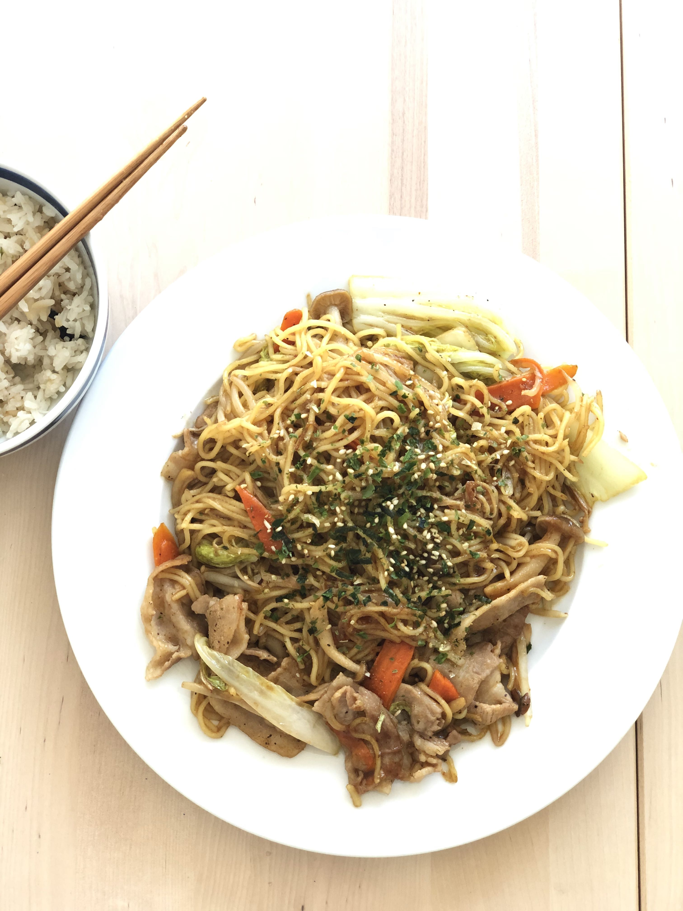

The classic japanese stir-fried noodle gives me all the necessary nutrients.
The sesame seaweed topping brings out even more flavor. Highly recommend, the
seaweed flakes just makes everything 10 times better. I learned it Masa's
[Yakisoba video](https://youtu.be/8-kIA-qSVjk). I don't have tonkatsu sauce
so I added more sugar, soysauce and some vinegar to emulate the sweet and
sour taste of the tonkatsu sauce.

From Masa's [日式Yaki-Soba炒麵做法/ yaki soba《MASAの料理ABC》](https://youtu.be/8-kIA-qSVjk)

## Yaki-udon (Stir-fried Udon)

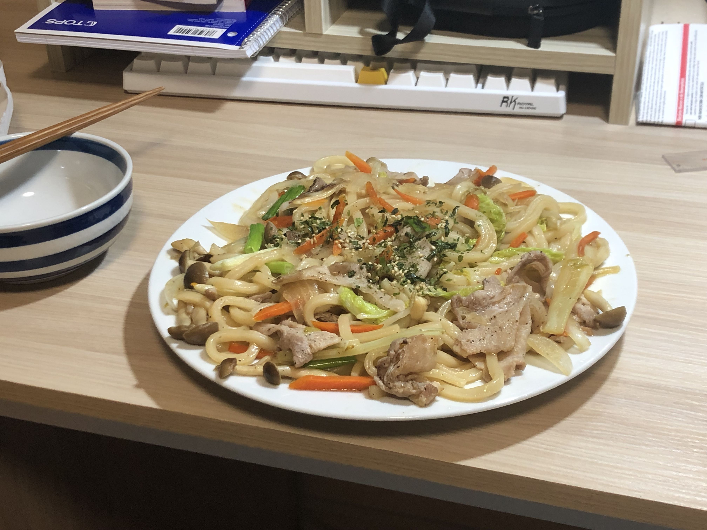

A variation of Yakisoba but I replaced the "soba" noodle with Udon. 
Soba (そば) actually means noodle made from buckwheat. However, the "soba" 
in Yakisoba refers to Chinese oil noodle (油面).

## Wafū Pork Spaghetti with Cream-Miso Sauce

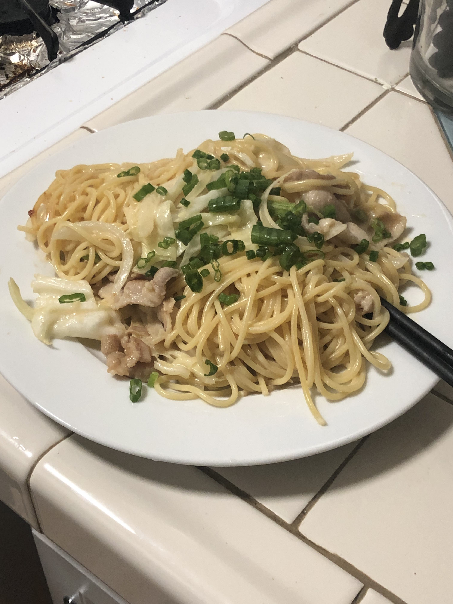

"Wafū" means "Japanese style". The pasta is made with Japanese flavor using
miso as the main ingredient in the sauce. I also added mirin and soy sauce as
seasoning. The [original recipe](https://youtu.be/CHv7peohOUI) from Masa also
put sesame, but I didn't have it so it is just miso and cream. I added
cabbage to give it extra crispy texture.

From Masa's [白肉胡麻味噌義大利麵/Pork Shaybu Spagetti with Miso Tahini Sauce |MASAの料理ABC](https://youtu.be/CHv7peohOUI)

## Miso Stir-fried Chicken Udon with Mushroom and Celtuce 

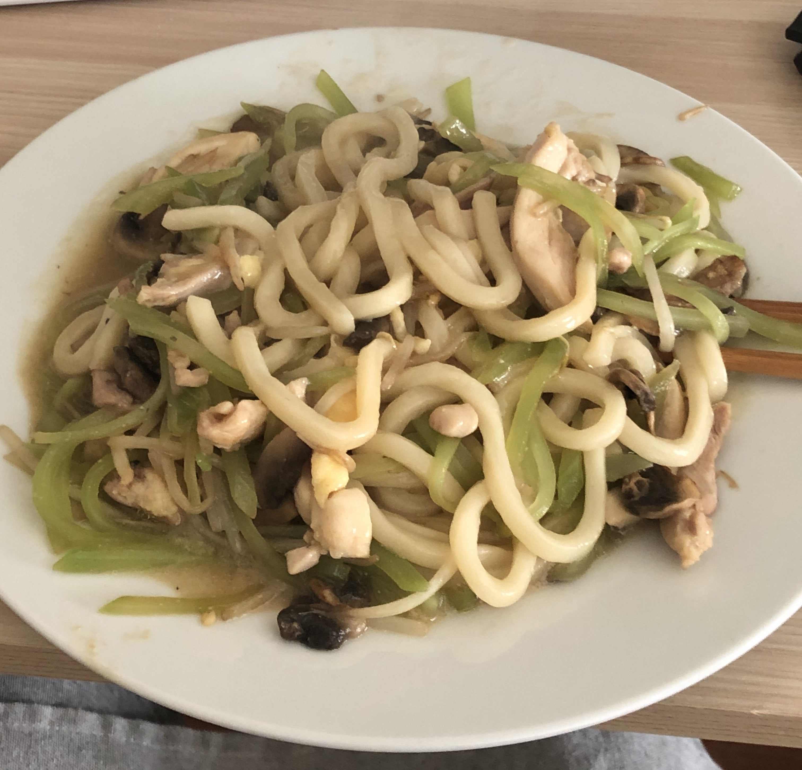

Celtuce (萵筍), also known as asparagus lettuce or chinese lettuce, has a
crispy and refreshing texture. It is very light dish despite the miso sauce.

## Vegetable Stir Fry

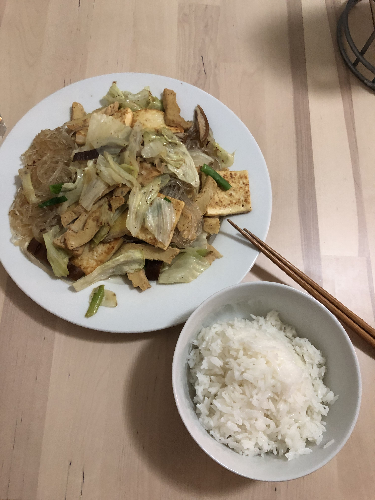

It is an everything-in-one-pot type of dish. The inspiration comes from a
dish named ["Buddha's
Delight"](https://en.wikipedia.org/wiki/Buddha%27s_delight). In my version, I
put pan-seared tofu, iceberg lectuce, black mushrooms, vegetarian chicken
(made from soy bean), and glass noodle. The glass noddle absorbs all the
flavor and tastes amazing.

> __Fun fact__: there is a specific type of vegetarianism called [Buddhist
vegetarianism](https://en.wikipedia.org/wiki/Buddhist_vegetarianism), which
excludes pungent plants such as garlic, shallots, coriander. If Buddha's
delight is made with garlic, it makes it surprisingly "not buddhist".

## Teriyaki Chicken Sandwich 

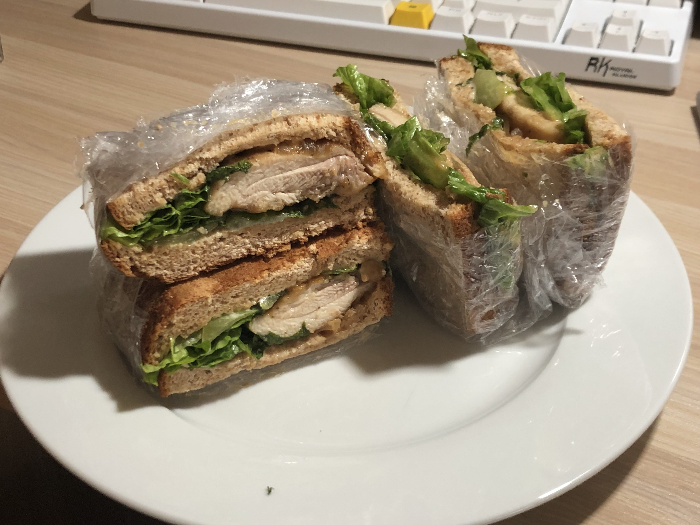

The hardest part about making Teriyaki chicken is that since the chicken is
marinated with Teriyaki sauce, they get burnt really quickly if the heat is
too high. At the same time you need to make sure that the slow heat cook the
chicken all the way through so it is not raw. 

I actually prefer using whole wheat bread compared to white bread. Teriyaki
sauce is already sweat in flavor. Whole wheat bread balances the sweetness
out. With white bread it gets too heavy for my taste. 

From Masa's [雞腿南蠻漬風三明治做法/ chicken teriyaki sandwich《MASAの料理ABC》](https://youtu.be/QDXk0SYyagg)

## Chicken Teriyaki Donburi

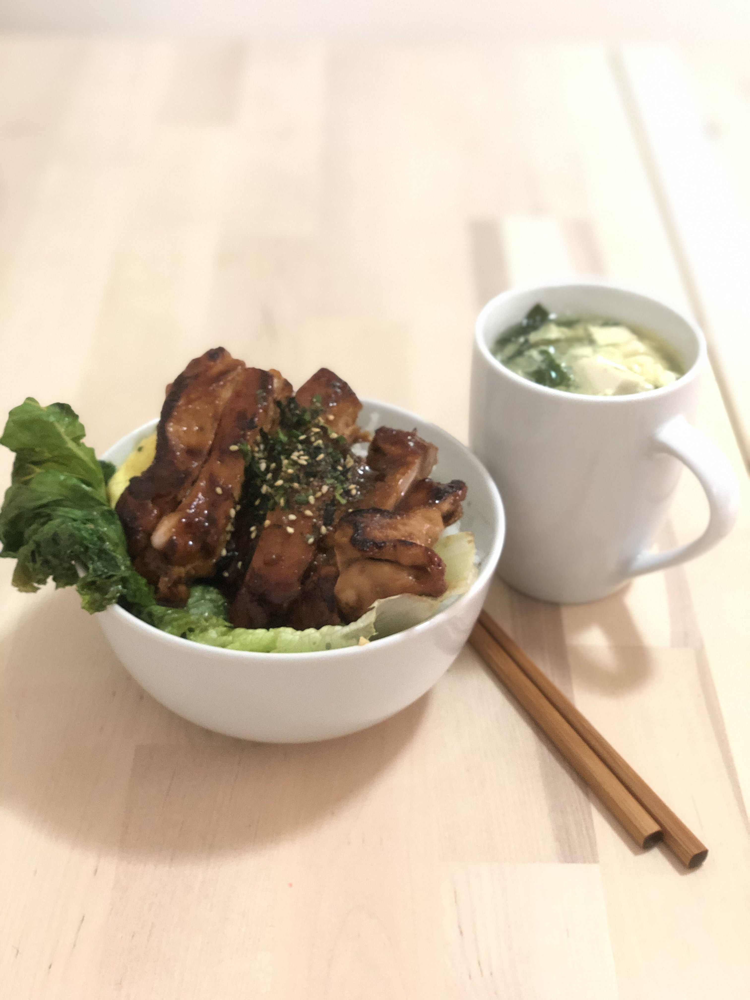

Donburi translates to bowl, meaning a dish with a bowl of rice. Under the
chicken is a fried egg and rice. The content in the cup is actually Miso
soup. Putting Miso soup in a cup make it easier to drink (or I just happened
to run out of bowls).

## Sukiyaki Udon

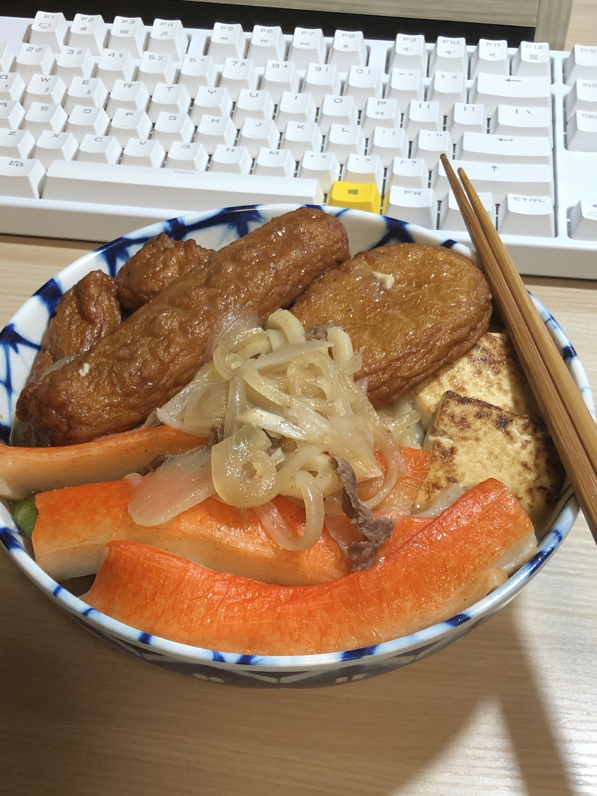

Sukiyaki is like hot pot, where the ingredient simmered in a pot with a soup
based in soy sauce and mirin, which is sweet in flavor. I overloaded it with
fish cakes and imitate crab meat (the orange sticks) and pan seared tofu. It
can also simply be made much simpler with just some meat and veggie as well.

From Masa's [壽喜燒烏龍麵做法/ sukiyaki udon《MASAの料理ABC》](https://youtu.be/svElI5ByjhM)

## Sukiyaki Chicken Udon with Choy Sum Fried Rice

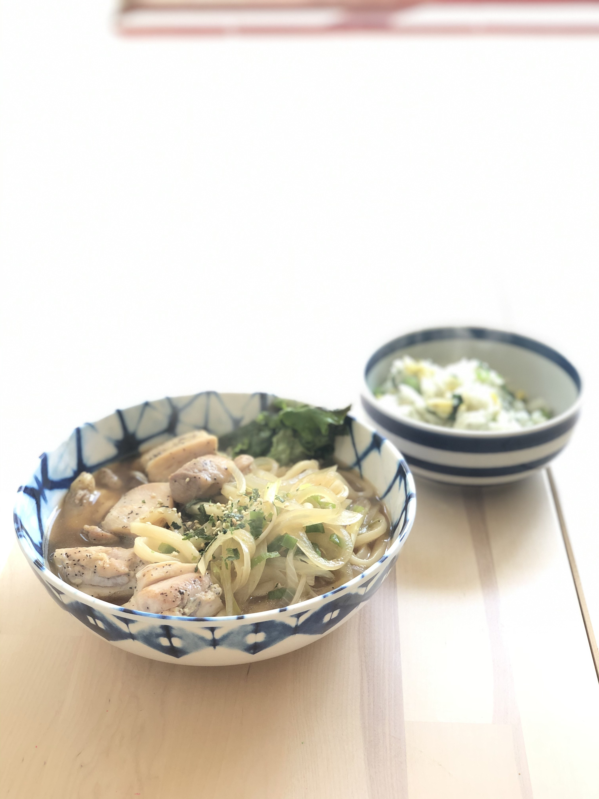

A variation of sukiyaki udon with Chicken as the protein. Apart from Udon as
the source of starch, I also added a small bowl of choy sum (菜心) fried rice.
Choy sum works unexpectedly well in fried rice. In Japanese ramen shops, you
can often order a bowl of rice to go with your ramen as well. Added my own
Chinese twist with the fried rice which makes it a fulfilling meal.

## Garlic Choy Sum Fried Rice

Apart from just choy sum, adding some fried garlic to add some crispy texture 
to the fried rice. Yum Yum. The idea of adding fried garlic to fried rice 
also came from Masa!

Inspiration taken from Masa's: [和風牛肉大蒜炒飯/ garlic stir fried rice《MASAの料理ABC》](https://youtu.be/hYjLS6IQi8w)

## Spinach Chicken Pasta with Cream Sauce

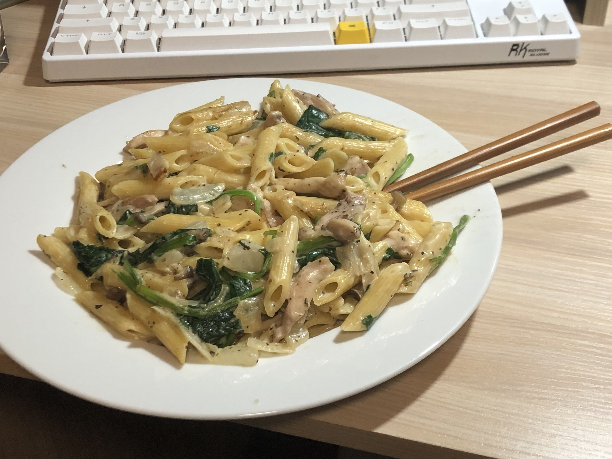

Pardon the chopsticks, I am more comfortable with them. I personally prefer
creamy sauce compared to tomato based ones. The sauce cooked with fried onion
for a touch of natural sweetness.

## Sauerkraut Shredded Pork Noodle

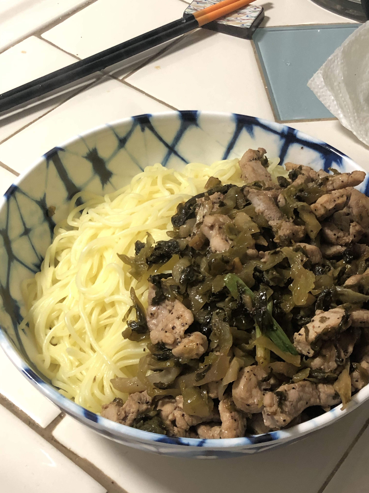

This is a common dish found in Chinese noodle shops, known as 酸菜肉絲面 in
Chinese. Sauerkraut (酸菜), type of pickled vegetable, stir fried with pork to
make a great topping for noddle. The sourness makes the dish very appetizing.

## Oyakodon 

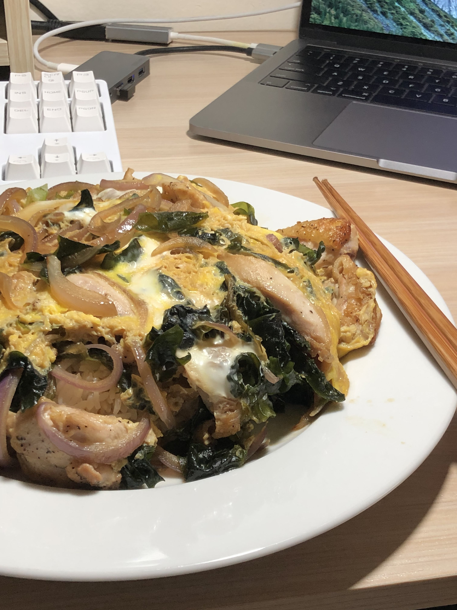

Oyakodon (親子丼) literally means "bowl of parent and child", since it is made
from egg and chicken. The sauce usually requires dashi, a stock based in
kombu (kelp) and bonito shaves. Since I didn't had a stock prepared up ahead,
I added the dried kaisou (海藻) salad pack to compensate for the missing umami,
which is available at Japanese supermarkets:

From Masa's [香煎滑嫩親子丼做法/ oyako don《MASAの料理ABC》](https://youtu.be/EiCNYPBZ6As)

## Gyudon

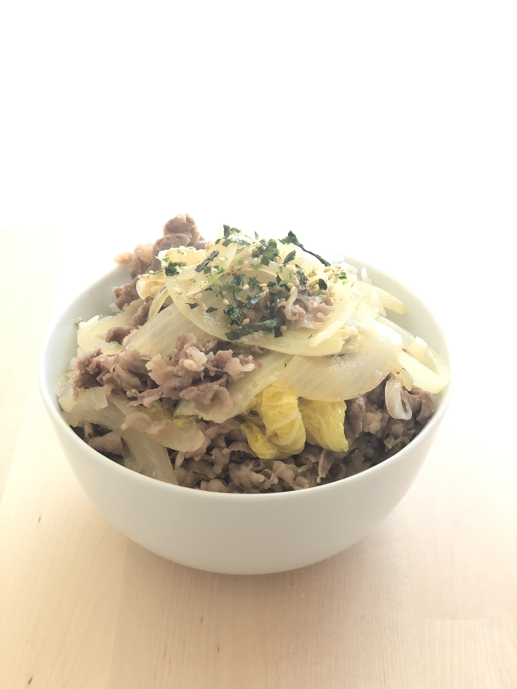

Gyudon, the beef rice bowl that I would usually get from Yoshinoya. 
But man, the Yoshinoya in the US just can't get it right. I also boiled 
some baby chinese cabbage in the Gyudon sauce. Napa cabbage would also 
work as well!

From Masa's [簡單吉☆家風牛丼/ gyu don《MASAの料理ABC》](https://youtu.be/UsBBNG9iSnw)

## Gyoza with Ramen

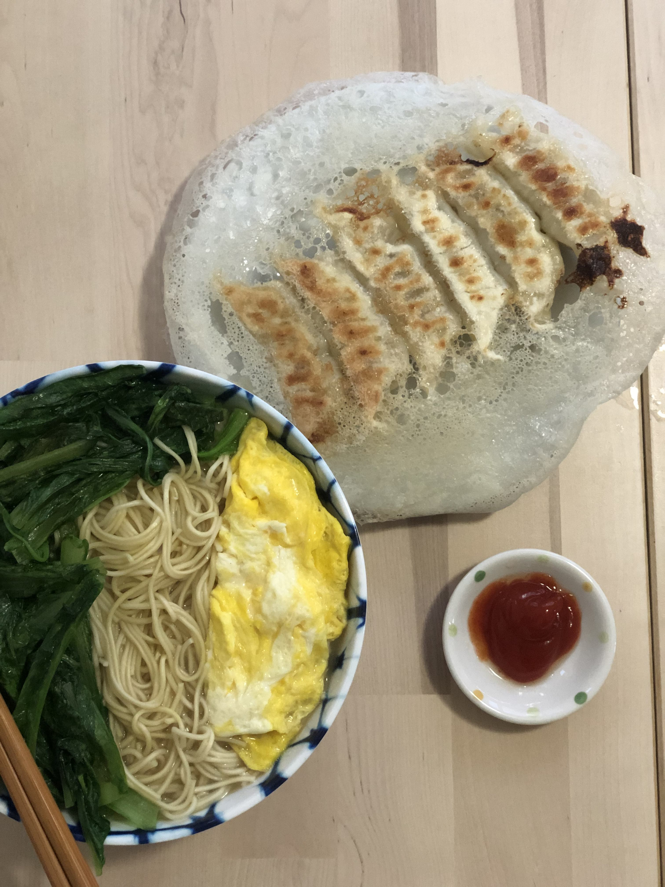

I was feeling lazy that day therefore I brought some of the ramen
pack from the Japanese supermarket. Added a fried egg and some fried 
Indian lettuce 油麥菜 (no idea what's the relation with India.)

On the gyoza (dumplings), there is a layer of crust. It is a crust formed from 
starch water evaporated in the heat. For more details on how that is made,
see Masa's video!

From Masa's [酥脆羽根日式餃子/Hane tsuki Gyoza|MASAの料理ABC](https://youtu.be/E8QkYjga-lY)

## Deep Fried Scallop With Spinach Mushroom Udon

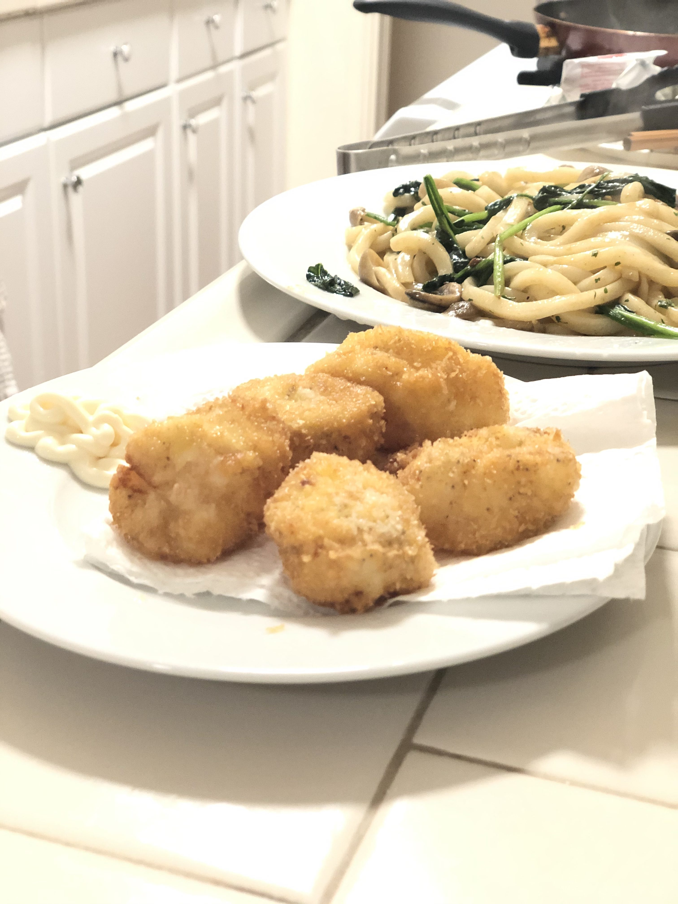

This one is probably one of the more expensive dishes that I make. I never
realized that scallops are so expensive. The idea came from the fried scallop
sold at the canteen from my high school in Hong Kong. The one from canteen is
imitated scallop so I want to try the real deal. Didn't disappoint at all.

The Udon is made with olive oil, garlic, spinach and mushroom. Simple and
delightful and won't fight with the flavor of the scallop.

## Chicken Curry

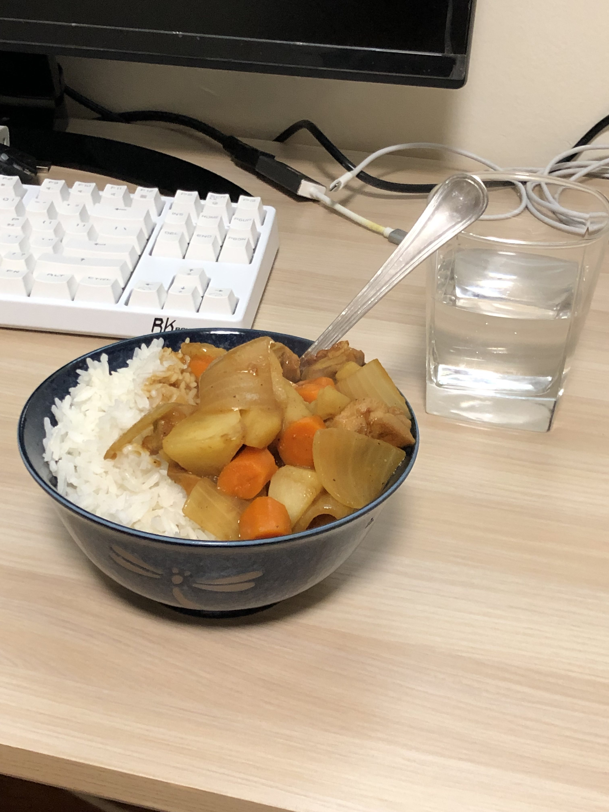

Simple japanese chicken curry. Not much to explain. The best comfort
food. 

## Chicken Curry Udon

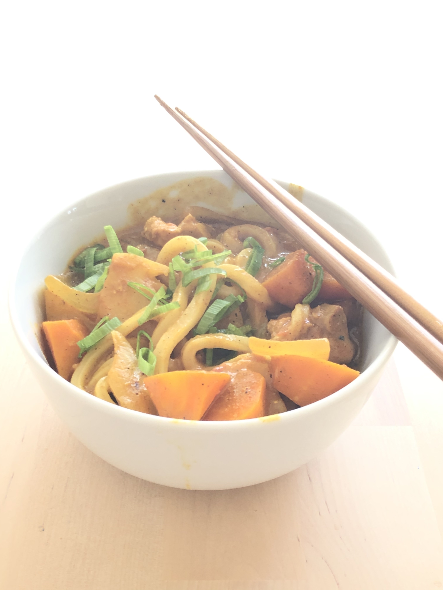

You cooked a pot of curry yesterday for dinner and what would you do with the
leftover? Easy, make a quick and easy chicken curry udon for lunch!

## Chicken and Scallion Stew

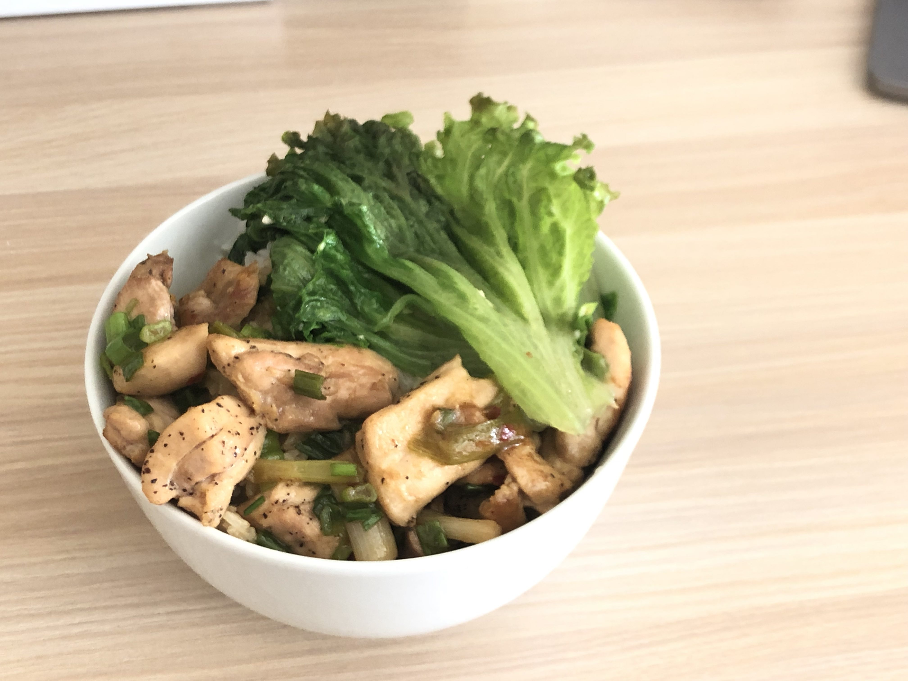

A perfect stew to go with rice. A bit spicy and very filling. This time the
recipe is not from Masa (finally). Quick and easy to make as well! Highly
recommend.

From Rosalina's [這是一道你無法抵擋的下飯菜～蔥燒雞燴飯！好吃到飯鍋見底啦～chicken and Scallion stew [Eng
Sub]](https://youtu.be/PQna_Xg6p-E)

That's it! Thanks for reading and I apologize if that make you hungry. Go
treat yourself with some food. To whoever says college students eat
badly, I like my college food. 
