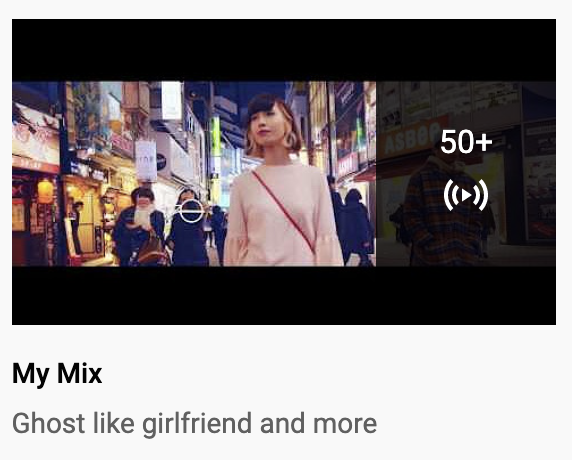
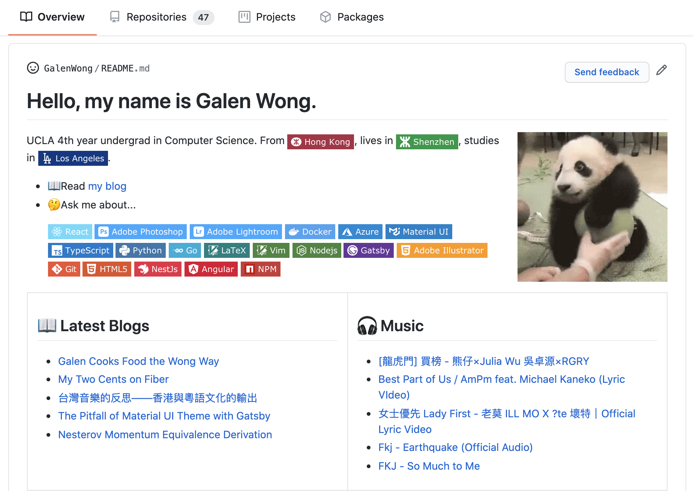

Sharing your music taste with others is uneasy, as it is something intimate
and personal. There is the fear of rejection, fear of criticism against your
devotion to your favorite singer.

Yet, we disclose our music taste almost unconditionally with "someone" that
we have never met, never spoken to. By listening to songs using popular
streaming service, we are giving away our preferences. For me, I listen to
songs on YouTube. Each click I make, each song I listen to, each search I do,
all give a little piece of my music palate away.

<blockquote>
<h3>
  There are at least two copies of my music taste: the one sitting in my
  brain and <i>the one encoded in the YouTube algorithm</i>.
  
</h3>
</blockquote>

Not gonna lie, YouTube does give me good recommendation and does a great job
at finding similar songs within the genre that I like. There is a feature
dedicated to this called [YouTube
Mix](https://support.google.com/youtube/answer/9011078?hl=en). It often shows
up in the feed page as the playlist "My Mix". It also comes up when you
search for "my mix" in the search bar.

<div style="max-width: 300px; margin: 0 auto">
  
</div>

This playlist is dynamic. It changes its recommendation based on your current
music taste (on YouTube that the algorithm is aware of). To a certain extent,
you can think of it as a snapshot of your current music preferences. 

If you find this playlist enjoyable and don't want to lose the list of songs, 
you can always save it into a permanent playlist. You can share it with other 
if you want to!

What if you want to share your _current_ preference with others? You can't 
since you cannot share the forever mutating recommendation. You can spare the 
effort to store "My Mix" everyday, but that is way to troublesome...

### Following the GitHub Profile Hype

It was the
[all](https://www.aboutmonica.com/blog/how-to-create-a-github-profile-readme/)
[that](https://medium.com/@jasonganub/how-to-create-a-github-profile-readme-b0ac0f081568)
[GitHub
profile](https://docs.github.com/en/github/setting-up-and-managing-your-github-profile/about-your-profile)
[hype](https://towardsdatascience.com/build-a-stunning-readme-for-your-github-profile-9b80434fe5d7)
that got me into thinking about my music preference. What if I shared my
music taste on my github profile README? A completely automated GitHub Action
that lists the top 5 songs from "My Mix". Technically, the list of songs doesn't 
come from me directly. I never put in any song manually. It is all what YouTube
thinks I like.

The first thing that came to my mind was the [YouTube Data
API](https://developers.google.com/youtube/v3). It should be using the
[`playlistitems`
resource](https://developers.google.com/youtube/v3/docs/playlistItems). But
to get a playlist, we need its ID. The playlist is dynamic, how do we get the
ID?


Conveniently, the "My Mix" playlist has a special fixed ID: `RDMM`
([source](https://webapps.stackexchange.com/a/116496)). But the issue is that
this ID is the same for everyone. How do I query for specifically "My
Mix" that YouTube generates for me?

By reading through the API docs, I found that the `playlistitems` API 
fetches the playlist from the **given channel**, which means that the channel,
therefore the user, is identified by whoever invokes the API. To invoke the 
API for the user, we would need to obtain the oauth token. That is it, we just 
need to do the following few steps:

1. Obtain access to YouTube Data API
2. Obtain user (myself) permission to access their data, therefore receiving
its oauth token
3. Call the API regularly and update my README

Here is a little caveat: oauth token expires. Once it do, we would need to
regain permission from the user (myself), which is a manual repetitive
process. Luckily, oauth offers a way for us to regain permission after the
current token expires. There is something called refresh token, which is a
token that enables us to obtain a new access token. Read more about it here:
[Using OAuth 2.0 to Access Google
APIs](https://developers.google.com/identity/protocols/oauth2#basicsteps).

Therefore, our steps would become:

1. Obtain access to YouTube Data API
2. Obtain user (myself) permission to access their data, therefore receiving
a temporary oauth token
3. Use the temporary oauth token to get a refresh token 
4. Call the API regularly and update my README

### Tutorial 

#### 1. Obtain access to YouTube Data API

Follow the step 1-3 listed on the guide: [YouTube Data API
Overview](https://developers.google.com/youtube/v3/getting-started).

After enabling access to the YouTube Data API, head to the tab "_OAuth
consent screen_"create an external OAuth consent screen. 1) Fill in an
Application name. 2) Add the scope of `youtube.readonly`. You do not need to
submit it for verification, since you would be the only one using this API.
Just go ahead and click save.

Now, go to the "_Credentials_" tab in your project. Create an "_OAuth client
ID_" with the application type being desktop app (in fact, it does not
matter). Now, you should be able to down load a client secret JSON file. The 
file should look something like this:

```json
{
  "installed": {
    "client_id": "1234567-abcdefgh123.apps.googleusercontent.com",
    "project_id": "lofty-gravity-12345",
    "auth_uri": "https://accounts.google.com/o/oauth2/auth",
    "token_uri": "https://oauth2.googleapis.com/token",
    "auth_provider_x509_cert_url": "https://www.googleapis.com/oauth2/v1/certs",
    "client_secret": "A_fej13kjov93jP_",
    "redirect_uris": [
      "urn:ietf:wg:oauth:2.0:oob",
      "http://localhost"
    ]
  }
}
```

This file contains the `client_secret`, which lets Google API to identify
which app project is using it.

#### 2. Obtain user permission and user oauth token

Directly working with the oauth workflow is difficult and hard to understand.
Therefore, I have written a Python script that automates the process. Go
ahead and clone the repo
[GalenWong/fetch-youtube-oauth-token](https://github.com/GalenWong/fetch-youtube-oauth-token).

The README of the repo should walk you through how to install it. To invoke
the script, you have to pass it the path to the client secret JSON file that
was obtained in step one.

```bash
python fetch-token.py path/to/client-secret.json
```

> Note: **Don't trust my script!** Go ahead and read it and make sure you 
> understand what it is doing. The script consumes your secret so be 
> careful with it!

A link will be outputted. Go to that link and it would be a Google account
log in page. After log in, you would see the oauth consent screen asking you
for read access to your YouTube account. It would warn you about the fact
that it is not verified and there might be security concern. Since you are
the one who created the project and you are the only one using it, go ahead
to click confirm. 

Now it should take you to a new page, with a text showing you a token. The
token is your oauth token. It enables access to the YouTube data API.
However, it is temporary and will expire within a day or so.


#### 3. Use the temporary oauth token to get a refresh token 

After obtaining the oauth token, copy and paste it back to the script. The
script is still waiting for an input. After that, a file named
`credentials.json` will be generated and it looks something like this:

```json
{
  "token": "ya29.somereallylong-client-token",
  "refresh_token": "1//a0Ab-Afasdfonfi-adfawf-M",
  "token_uri": "https://oauth2.googleapis.com/token",
  "client_id": "some-client-id.apps.googleusercontent.com",
  "client_secret": "SomeClientSecret123-Ab_C"
}
```

Notice that we now have a `refresh_token`. 

#### 4. Call the API regularly and update the README

To call the API regularly, we can use GitHub Action. It has an option to
configure it to run as a cron job. The YAML configuration looks something
like this:

```yaml
name: Update README with YouTube My Mix
on:
  schedule:
    - cron: '0 * * * *' # runs every hour
jobs:
  update-readme:
    name: Update the profile README
    runs-on: ubuntu-latest
    steps:
      - uses: actions/checkout@v2
      - name: Set up Python
        uses: actions/setup-python@v2
        with:
          python-version: 3.8
      - uses: actions/cache@v2
        name: Configure pip caching
        with:
          path: ~/.cache/pip
          key: ${{ runner.os }}-pip-${{ hashFiles('**/requirements.txt') }}
          restore-keys: |
            ${{ runner.os }}-pip-
```

We have a few steps in the action already. We checkout the repo, set up
python so that it is available, also set up pip caching so that dependency
installation would be faster.

Now let's write the script. The script needs a few dependencies. Create
a `requirements.txt` file to specify them:

```text
google-api-python-client
google-auth
google-auth-oauthlib
google-auth-httplib2
```

In the script import the required modules:
```py
# write_youtube_mymix.py
from googleapiclient.discovery import build
import google.oauth2.credentials
import os
```

Let's assume that we have access to the tokens through the environment 
variables. We will first access them through `os.environ`:

```py
# write_youtube_mymix.py
TOKEN = os.environ['TOKEN']
REFRESH_TOKEN = os.environ['REFRESH_TOKEN']
CLIENT_ID = os.environ['CLIENT_ID']
CLIENT_SECRET = os.environ['CLIENT_SECRET']
```

We will create a Google oauth credential object from those tokens:

```py
# write_youtube_mymix.py
credentials = google.oauth2.credentials.Credentials(
    token_uri='https://oauth2.googleapis.com/token',
    token=TOKEN, 
    refresh_token=REFRESH_TOKEN,
    client_id=CLIENT_ID,
    client_secret=CLIENT_SECRET)
```

Then, we initialize an YouTube API client using the credentials and fetch 
the data:

```py
# write_youtube_mymix.py
youtube = build('youtube', 'v3', credentials=credentials)

resp = youtube.playlistItems().list(
                                part='snippet', 
                                maxResults=25, 
                                playlistId='RDMM').execute()
```

To make the query, we specify the `playlistId` as `RDMM`. The `part` means 
which fields we want to get. Using `snippet` indicates we are fetching 
everything.

Now the `resp` variable is an dictionary containing our playlist. To see what
it looks like exactly, play with the [YouTube API
explorer](https://developers.google.com/youtube/v3/docs/playlistItems/list).

Now we transform the data into a list containing dictionaries with `name` 
and `link`:

```py
# write_youtube_mymix.py
videos = []
for video_item in resp['items']:
    name = video_item['snippet']['title']
    video_id = video_item['snippet']['resourceId']['videoId']
    link = f'https://www.youtube.com/watch?v={video_id}'

    videos.append({ 'name': name, 'link': link })
```

Now you can do whatever you want with it. Transform it into a markdown list
and inject it into the markdown file. Go ahead see my full script here:
[write_youtube_mymix.py](https://github.com/GalenWong/GalenWong/blob/054d213b02c5048933e4c3750ada2b17fdbd5bde/write_youtube_mymix.py)

#### Accessing the oauth token and secrets

We would need to access the secret. **Do not commit the `credentials.json`
and the client secret JSON file in to the GitHub repo.** As the names imply,
those are secret and uploading them to the web is a bad idea. Then, how would
the tokens be available in the Action then?

GitHub offers a safe way for us to store secrets so that it is available in
the secret. Follow the steps here to upload the secrets: [Creating encrypted
secrets for a
repository](https://docs.github.com/en/actions/configuring-and-managing-workflows/creating-and-storing-encrypted-secrets#creating-encrypted-secrets-for-a-repository).

We would need to create 4 secrets from the `credentials.json` file. They are:

- `token`
- `refresh_token`
- `client_id`
- `client_secret`

After we have created the secrets, we can access it in the GitHub workflow YAML 
file. Since the script will access the secrets through environment variables, 
we inject them in the workflow:

```yaml
- name: Write MyMix to README
  env:
    TOKEN: ${{ secrets.YOUTUBE_TOKEN }}
    REFRESH_TOKEN: ${{ secrets.YOUTUBE_REFRESH_TOKEN }}
    CLIENT_ID: ${{ secrets.YOUTUBE_CLIENT_ID }}
    CLIENT_SECRET: ${{ secrets.YOUTUBE_CLIENT_SECRET }}
  run: |
    python write_youtube_mymix.py
```

I named the secrets with a `YOUTUBE_` prefix here and I named my script
`write_youtube_mymix.py`. Note that you need to commit
`write_youtube_mymix.py` script under the root directory of your project.

Lastly, we need to commit and push the changes.

```yaml
- name: Commit and push
  run: |
    git diff
    git config --global user.email "your@email.com"
    git config --global user.name "mymix-bot"
    git pull 
    git add -A 
    git commit -m "Update YouTube Mymix" || exit 0
    git push
```

Note that if you set `user.email` to your GitHub email, it will show up on
your contributions. If you don't want the bot to clutter up your contribution
history graph, use a different email.

Now, you have a script that fetches your custom YouTube song recommendation. 
After hooking it up to update your README, it can auto update!

<figure align=center>



<figcaption>
The "Music" section is where I show my encoded music taste in YouTube .
</figcaption>

</figure>

## Into the Future

My initial thought is to publish this as a custom reusable action, just like
the [blog post
workflow](https://github.com/gautamkrishnar/blog-post-workflow) that auto
updates the docs. However, a large portion of the action is very boilerplate
code. For instance, installing Python, setting up pip cache, checking out the
repo, etc. I would like to reuse the other action as much as possible instead
of writing redundant code. 

However, the GitHub Action does not currently support calling other Action
within the custom Action. Therefore, the publishing of this YouTube MyMix
fetch is blocked by this [GitHub
issue](https://github.com/actions/runner/issues/646). Hopefully the GitHub
team can flush out the feature soon so I can publish this as a good Action
with less boilerplate code.

At the mean time, please reference [my GitHub profile
repo](https://github.com/GalenWong/GalenWong) for how to implement this! Feel
free to raise issues on that repo if you have any questions.
