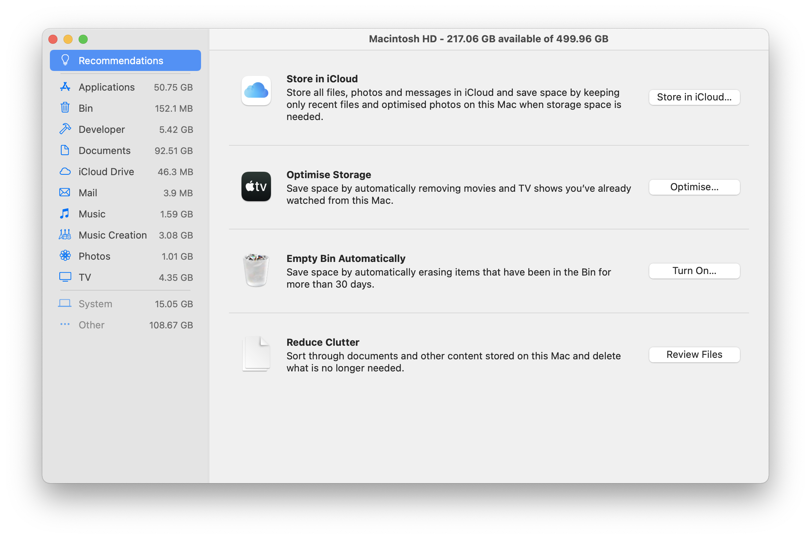

> TLDR; 
> 1. Use _System Information_ and `du` to get an idea of what is taking up your space.
> 2. If you have JavaScript project with huge `node_modules` that you don't need anymore, remove them.
> 3. Check your `~/Library/Application Support/MobileSync/Backup`. If you backup your iPhone somewhere else (like iCloud), this can go away.
> 4. Remove any IDE/sdk/tools that you don't need any more. For me, it was Android Studio and Android SDK.
> 5. Check your Docker to see if there are containers/volumes/images that you can remove.


I got my current MacBook Pro in 2017. It is meant to be my college workbench
for my computer science classes. It has served me well with its 500 GB hard
disk. However, in 2021, my disk space only has 90 GB left. There is still
quite some space. But the worry comes from the trend of stable growth. Over
the 3.5 years I had the machine, I used up 410 GB of disk space, which
averages to 117 GBs per year. That means my hard disk won't last me through
another year! This is a sign for me to do something.

This article records how I reclaimed some disk space in my Mac. 

## Media and code takes up space, but not that much...

I start thinking back what can possibly takes up so much space on my laptop. 
Two of my biggest sources of disk space consumption are media and code.

I used to take pictures quite regularly and the RAW files take up a lot of
space indeed. After importing them into Adobe LightRoom they generate a
separate DNG, taking up almost twice as much space. But since the pandemic, I
haven't really taken much pictures any more. A quick inspection of my picture
folders showed that it didn't take up more than a few GB of spaces. Another
source is all the videos I download, for watching with my friend or when I am
travelling on the plane or train. They usually get stored in the Downloads
directory. And I remove them quickly after I finish watching them. So Media
shouldn't really take up much space.

I program in JavaScript a lot. I did React, Gatsby, React Native, Electron
projects. All of them have pretty heavy `node_modules` folder. So they might
also be taking up some space as well. I deleted all of the JavaScript project
that has been uploaded to GitHub, only keeping the ones that I actively work
on. Yes, I got to reclaim may be 1-2 GB of space but not much from that. 

I don't generate much media data and code. They don't take up too much space
as well. Where is all my disk space?

I need a map to see where my space ended up being used. 

## Exploring disk space

OS X comes with built in map for us to see disk use distribution. Click the
Apple Logo on the top left, click _About This Mac_, choose the _Storage_ pane
and click _Manage_. This takes us to a handy manager that calculate our disk
distribution. 

<figure align=center>



<figcaption>

_The built-in storage manager. This is after I cleaned up my storage space._
</figcaption>
</figure>


If you click on each category, it shows up the largest documents in that
category. My largest category is _Documents_. It comes from my giant textbook
pdf for my math classes, giant zip file containing training data for my
computer vision projects. I can do some cleaning on this end. 

However, the most annoying one is the category called _Other_. I can't click
on it. I don't possibly know what files there are that is taking up so much
space. From the screenshot, it is taking up 108 GB of space but before
cleaning up it took up almost 200 GB! It was such a frustration. The good
news is that I am writing this article right now and you see that I managed
to chop the size in half. Let me show you how.

We need another way to figure out where our spaces went. A handy command
called `du` could be of help here. My idea is to start at my home directory
`~`, and see which folder is taking the most space. Then I recursively goes
into the folder to check what is taking up much space.

```bash
du -sh * | sort -h
```

`du -sh *` means print out disk usage in a human readable format (flag `-h`)
for the each entry specified (flag `-s`). The entries are the wildcard `*`
since I want to audit all directories in my home directory.

```sh
 26M	Applications
 82M	Movies
789M	Downloads
906M	Desktop
1.0G	go
5.4G	Code
5.8G	Music
6.0G	Pictures
7.4G	bin
 55G	Documents
107G	Library
```

I realize that the path `~/Library` is taking up a lot of spaces. So I went into it 
and checked where all my disk space went. 


There is a folder called `~/Library/Application Support/MobileSync/Backup`
that is taking up 10G. It is for backing up by iOS device (my iPhone).
However, I already back up the most important data on my phone and I don't
need this anymore. Therefore, I simply removed it.

Then, the folder called `~/Library/Android/` also takes up 7 GB. This stores
my Android development sdk. I know why this is here. I have taught an Android
development workshop series called [Hack
Sprint](https://github.com/uclaacm/hack-sprint-w20). I had to install Android
Studio and install the Android development sdk. I do not do Android
development anymore so I don't need it. It is time for them to go away. By
removing Android Studio and the Android sdk in the Library. It freed a good 9
GB of space. That reminds me of my cocoapod that I installed when I was
toying with iOS development. Time for `~/.cocoapod` to go as well (it also
takes up a few GB).

Undergraduate is truly when I get to learn and explore so many different
technologies. React Native, Electron, Android, iOS development, PHP and stuff
(you can't really tell that I am a frontend person here). However, at the end
of the day, I don't use all of them on a daily bases, and it is reasonable to
let go.

While I'm here, I also cleaned up some of the `.plist` files in
`~/Library/LaunchAgents` for the apps that I have uninstalled already. Also
other folders in `~/Library` that belongs to app that has already been
deleted. 

Cleaning up my `~/Library` is very effective.


## Docker 

Lastly, it has been a while since I have used Docker in my previous
internships. I didn't had the time to remove the containers and images. 
To check my disk usage:

```sh
docker system df
```

Shows that I have container and images that are taking more than 15 GB. 
I don't need them any more so they can go. 

```sh
docker system prune -a
```

For some reason, this will get stuck for me. I think it happens to a lot of
other Mac Docker user as well. Instead I manually removed them,

```sh
docker volume ls -q | xargs docker volume rm 
docker container ls -q | xargs docker container rm 
docker image ls -q | xargs docker image rm 
```

The `-q` flag is to tell the command to output only the ID of the
images/containers/volumes. Then we pipe them to `xargs` to delete them one by
one.

Now my laptop has 216 GB of free space. Brilliant.

