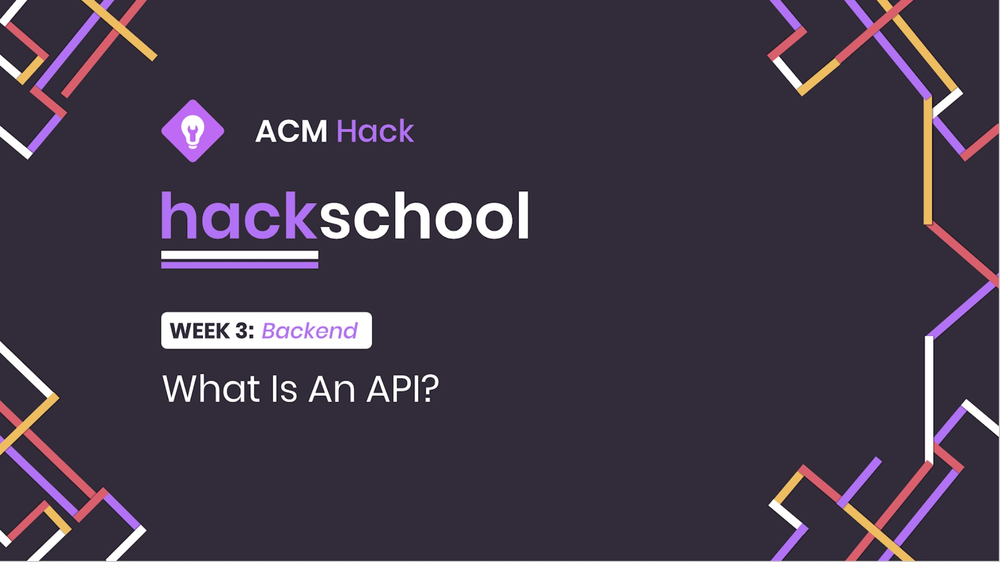
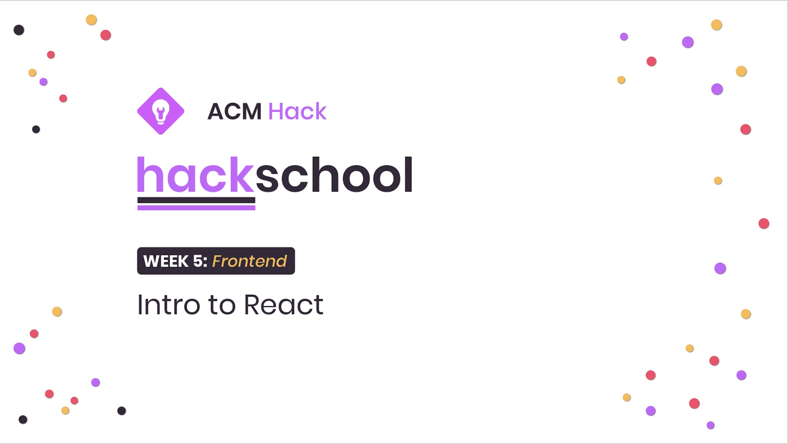
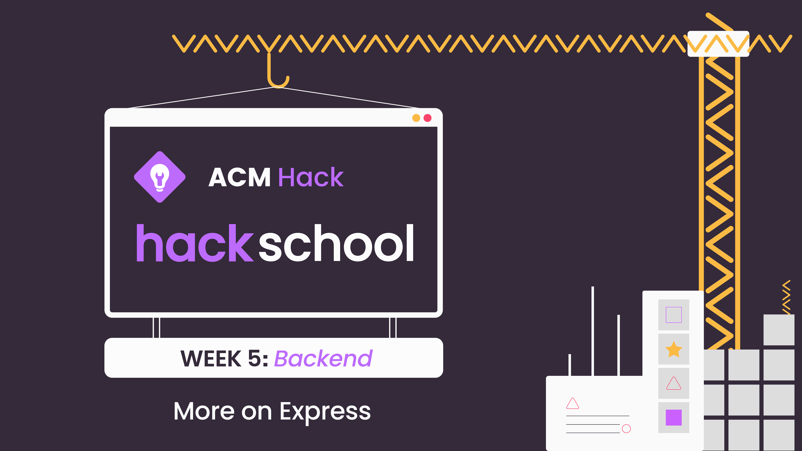
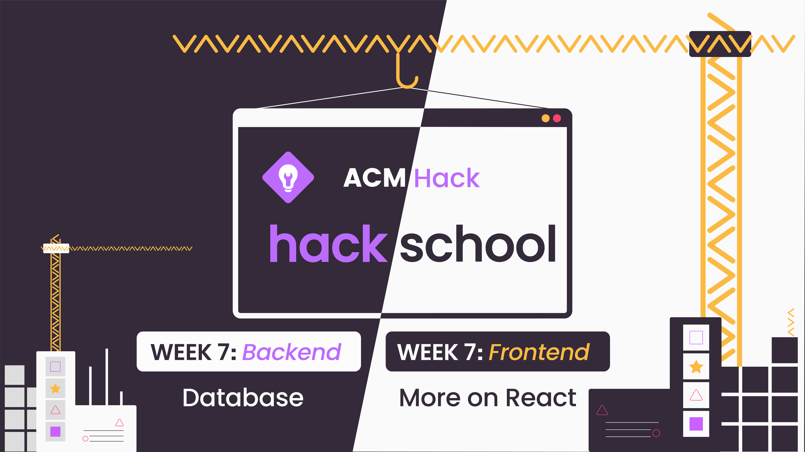
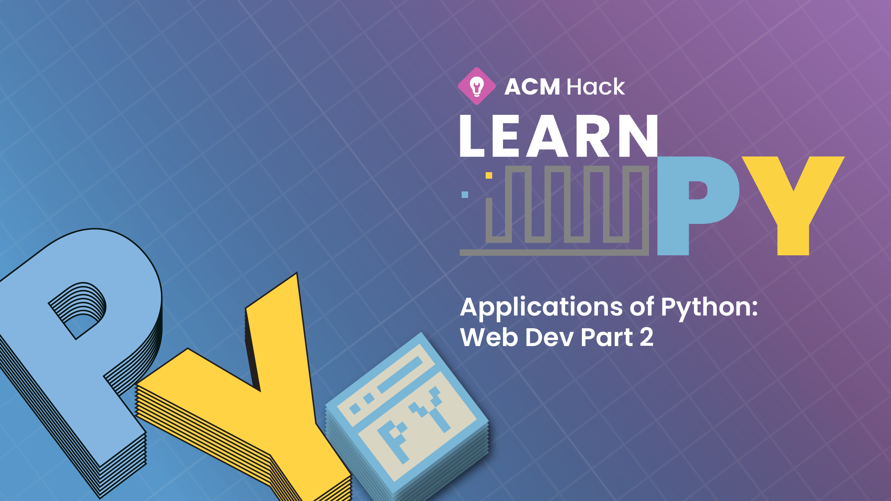
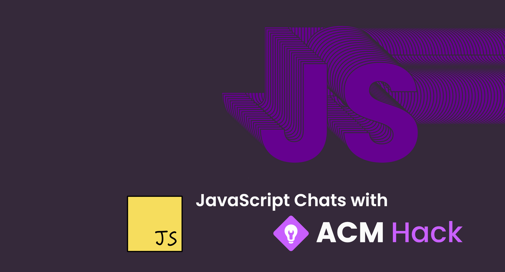
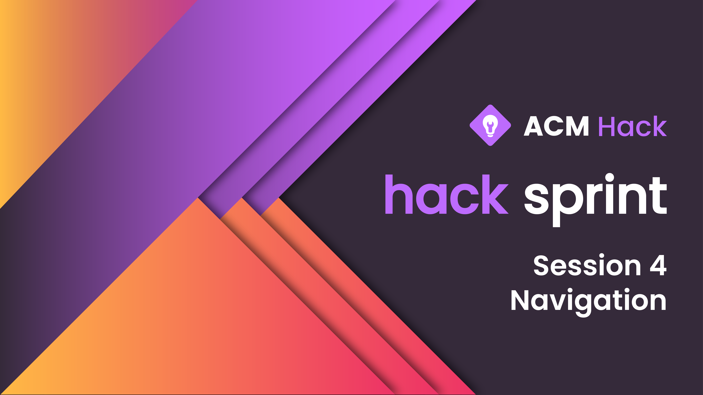
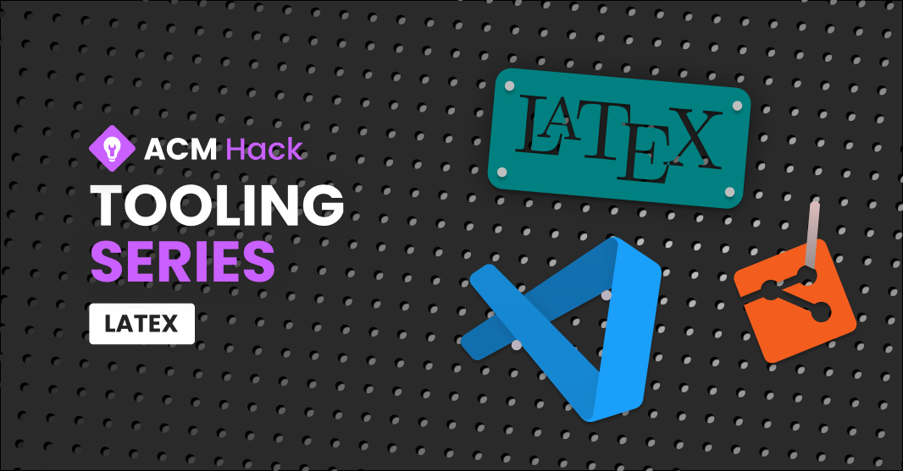

+ [Web Development: Hackschool](#web-development-hackschool)
  + [Hackschool Fall 2018 Session 3 Backend: What is an API?](#hackschool-fall-2018-session-3-backend-what-is-an-api)
  + [Hackschool Fall 2018 Session 5 Frontend: Intro to React](#hackschool-fall-2018-session-5-frontend-intro-to-react)
  + [Hackschool Fall 2019 Session 4 Backend: More on Express.js](#hackschool-fall-2019-session-4-backend-more-on-expressjs)
  + [Hackschool Fall 2019 Session 6 Backend: Introduction to Database](#hackschool-fall-2019-session-6-backend-introduction-to-database)
+ [Developing in Python: Learn.py](#developing-in-python-learnpy)
  + [Learn.py Spring 2019 Session 7: Web Dev Part 2](#learnpy-spring-2019-session-7-web-dev-part-2)
+ [Intermediate/Advanced JavaScript: JavaScript Chats](#intermediateadvanced-javascript-javascript-chats)
  + [JavaScript Chats Fall 2019 Session 1: Function and `this`](#javascript-chats-fall-2019-session-1-function-and-this)
  + [JavaScript Chats Fall 2019 Session 3: A Gentle Introduction to React Hooks](#javascript-chats-fall-2019-session-3-a-gentle-introduction-to-react-hooks)
  + [JavaScript Chats Fall 2019 Session 4: Optimizing Frontend and React Apps](#javascript-chats-fall-2019-session-4-optimizing-frontend-and-react-apps)
  + [JavaScript Chats Fall 2019 Session 6: Introduction to Testing with JavaScript](#javascript-chats-fall-2019-session-6-introduction-to-testing-with-javascript)
+ [Android apps in Kotlin: Hack Sprint](#android-apps-in-kotlin-hack-sprint)
  + [Hack Sprint Winter 2020 Session 4: Navigation](#hack-sprint-winter-2020-session-4-navigation)
+ [Tooling for developers: Tooling Series](#tooling-for-developers-tooling-series)
  + [Tooling Series Spring 2020 Session 4: $\LaTeX$](#tooling-series-spring-2020-session-4-latex)

During college, I was part of a club called [ACM
Hack](https://hack.uclaacm.com/). The club runs beginner friendly workshops
focused on web development, mobile development, or anything we find useful and
fun. We also did some intermediate/advanced workshops. Another big components
we did was (mini) Hackathon, socials and expo type events. 

I enjoy teaching so I taught a lot during my time at Hack. The blog post is a
summary of what I have taught before. The assets of each workshop usually
include a set of slides, a README (a text format of the workshop), and maybe
recording (mostly during the pandemic).

### Web Development: Hackschool

ACM Hack Hackschool is a signature event that introduces beginner to web development. 

#### Hackschool Fall 2018 Session 3 Backend: What is an API?

- topic: HTTP, JSON, API, how to use Postman, how to create this an endpoint in express
- assets:
  - [README](https://github.com/uclaacm/hackschool-f18/tree/master/session-3-backend-api)
  - [slides](https://docs.google.com/presentation/d/1an6ZLx0g-eRDSchPjTg34yiSvxHBo_3w18jizYduuHU/)

One of the major hurdles in learning web development is understanding client
server interaction and the concept of API. The workshop aims to taught
participants how to create an API endpoint in Express.js. 

#### Hackschool Fall 2018 Session 5 Frontend: Intro to React

- topic: what is React, what is `class` in JavaScript (this is the time before hooks), `setState`
- assets:
  - [README](https://github.com/uclaacm/hackschool-f18/tree/master/session-5-frontend-react)
  - [slides](https://docs.google.com/presentation/d/1tFhMnSbLLT7pRyxRdt_wO4ctZy7MUASlWGi_CZRB1Zw)
  
As people abandoned jQuery and moved on to more structured way to write web
apps, we kept up with trend to introduce beginners to React. We did so by
drawing connections between HTML and JSX syntaxes. 

#### Hackschool Fall 2019 Session 4 Backend: More on Express.js

- topic: module system in node.js, using express for API endpoint routing
- assets:
  - [README](https://github.com/uclaacm/hackschool-f19/tree/master/session-4-backend-express)
  - [slides](https://docs.google.com/presentation/d/1cy9AZdiZY5d3i59HL3ltGb1w0KX_-FNHHKZteRpa-ic/edit?usp=sharing)
  
Understanding the module system helps people break code into smaller, more
manageable chunks. Knowing how URL and routing works helps to break an APIs
service into smaller, more manageable chunks as well.

#### Hackschool Fall 2019 Session 6 Backend: Introduction to Database

- topic: what are database and why we need it, using Firebase
- assets:
  - [README](https://github.com/uclaacm/hackschool-f19/tree/master/session-6-backend-database)
  - [slides](https://docs.google.com/presentation/d/1RjCwhW5_mFhfwUQ8uzXsJd7VFsbctQH8K9Z1tFhqvEc/edit?usp=sharing)

Server programs are forgetful if we just store things in memory, they get wiped
out after the server shuts down. We need a way to persist data and therefore we
need a database. Using Firebase, we can set up a database quickly without much
hassle. 

### Developing in Python: Learn.py

Learn.py is a beginner friendly Python course that goes beyond the syntax. The
series touch on practical application like scripting, web scraping, data
mining, web development, etc.

#### Learn.py Spring 2019 Session 7: Web Dev Part 2

- topic: creating endpoint in Django, what is an API, JavaScript, JSON
- assets:
  - [README](https://github.com/uclaacm/learn.py-s19/tree/master/session-7-web-development-2)
  - [slides](https://docs.google.com/presentation/d/1WtkbIpaLZH94XGXe5nCp6tUKjvTAurjVVlZGr9ZPLtY/)
  
We covered using Django to serve webpages in the session before this one. So
this session is about creating API endpoints so that the frontend pages can
interact with it. I explained API calls as invoking function on a different
computer, and borrowed the term RPC (remote-different computer,
produce-function, call-invoke) to explain the concept. 

Sometimes you don't even realize how abstract concepts can be. Explaining what
an API is to a new programmer is hard, like "NP-hard" hard. 

### Intermediate/Advanced JavaScript: JavaScript Chats

JavaScript Chats is a series [Timothy Gu](https://github.com/timothygu) and I
started. I will quote the blurb we wrote for it to explain what it is:

> Learning a language or a framework outside of class can be hard, especially
> past the syntax and the standard APIs. Come out to JavaScript Chats with ACM
> Hack, a weekly discussion on intermediate/advanced JavaScript. This series
> aims to deepen your understanding of the language’s features and designs. We
> also plan to cover frameworks related topics.

The theme was to whine about JavaScript, but learn about it while complaining. 

#### JavaScript Chats Fall 2019 Session 1: Function and `this`

- topic: `function () {}` vs `() => {}`, `this`, comment arg passing syntax (`...`/object destruction)
- assets:
  - [README](https://hack.uclaacm.com/posts/fall2019/js-chat-1/)
  - [slides](https://docs.google.com/presentation/d/1-llkdwZlLSWKxjjP11phMlC30Mx5kTDrtKYR0uBjt-k)
  
Yes, one of the most annoying pitfall of JavaScript, the magical `this`. And why the hell are there two ways to write functions in JavaScript. 

#### JavaScript Chats Fall 2019 Session 3: A Gentle Introduction to React Hooks 

- topic: `React.useState`, `React.useEffect`
- assets:
  - [README](https://hack.uclaacm.com/posts/fall2019/js-chats-3/)
  - [slides](https://docs.google.com/presentation/d/1O8JpDK2tegV-JhbN0kF1Tia6aAAmUgvYsLHdgD97IuQ)
  
React hooks were the hippest coolest new kid in town back then. We wanted to
introduce people with previous React experience to transition to hook. I
touched on the philosophical differences between the `class` and the function
components (spoiler alert: it is how logic are grouped together in code, read the README to learn more). 

#### JavaScript Chats Fall 2019 Session 4: Optimizing Frontend and React Apps

- topic: Chrome DevTools, how does React load, React optimization
- assets:
  - [README](https://hack.uclaacm.com/posts/fall2019/js-chats-4/)
  - [slides](https://docs.google.com/presentation/d/11g4LMdzt4hCiAITzBLxYi2YRtLQBby4Ly6mXmpTv3Ls/edit)

A lot of people have frontend development experience. Knowing how to use the DevTools in Chrome definitely makes life easier. We taught how to profile a web app and how to interpret different metrics. We explained how React loads and why it might be slow due to excessive rendering. 

#### JavaScript Chats Fall 2019 Session 6: Introduction to Testing with JavaScript

- topic: TTD, Jest, mocking 
- assets:
  - [README](https://hack.uclaacm.com/posts/fall2019/js-chats-6/)
  - [slides](https://docs.google.com/presentation/d/1WBkYDYv-DfGCrF2uunmekK507_pSen-mkcZigCBud1Y/edit)

Testing is important. We all know that. This gives an introduction to the
benefits of Test Driven Development, how to use Jest for a good Test Driven
Development experience (extremely important), and what/why is mocking.

### Android apps in Kotlin: Hack Sprint

Mobile apps are how people interact with the world right now. We teach people
to use Kotlin ~~, the superior language over Java, ~~ for developing mobile
applications.

#### Hack Sprint Winter 2020 Session 4: Navigation

- topic: Gradle the build tool, Fragments, navigation through Fragments 
- assets
  - [README](https://github.com/uclaacm/hack-sprint-w20/tree/master/session-4-navigation)
  - [slides](https://docs.google.com/presentation/d/1Vz5SGFhrbajIJIBdOpMbs_I9ud7v3dRcgYPvWBgBPic/edit)
  
Having multiple screens is important within an application. Using Fragments, we
can set up multiple screen and how to move between them. 

### Tooling for developers: Tooling Series

There are a lot of useful tools that helps boost developer efficiency. But it
might also have some steep learning curve. Tooling Series introduce and teach
tools that can be useful. 

#### Tooling Series Spring 2020 Session 4: $\LaTeX$

- topic: using Overleaf for easy compilation of $\LaTeX$ document, simple
  layout and math commands within $\LaTeX$
- assets
  - [README](https://github.com/uclaacm/hack-tooling-series/tree/master/session-4-latex)
  - [slides](https://docs.google.com/presentation/d/1R5idS-YYpwiV7_dAPlCaOMC7y_BTQkgYnfnh4vq80i4/edit)
  - [recording](https://www.youtube.com/watch?v=pUDJLB1RDkA)

$\LaTeX$ allows you to gain more control over typesetting a document. It lets
you write beautiful documents that can contain domain specific text such as
math equations, chemical equations, graphs, code, etc. It is used heavily
within academics for typesetting research paper and homeworks. But it is also
useful in other context since forums like stackoverflow allows you to write
math equation in $\LaTeX$ syntax.
